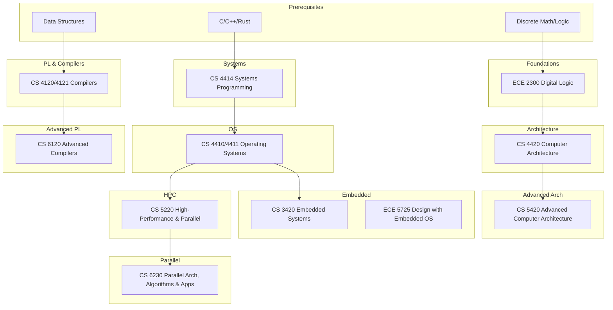

\
\
[Home]({{ '/' | relative_url }}) → [Computer Science]({{ '/csmajor/' | relative_url }}) → Low-Level Systems

# CS Major - Low-Level Systems ⚙️      
Field of study on the design and construction of computer systems and their component parts.

## Flow Map

## Prerequisite Courses:
- Programming in C/C++ (and/or Rust) — systems-level coding, memory models, tooling
- Data Structures & Algorithms (e.g., CS 2110/2112) — performance, correctness of core components
- Discrete Math & Logic (e.g., CS 2800) — FSMs, invariants, correctness proofs
- Computer Organization basics (e.g., ECE 2300) — ISA, pipelines, memory hierarchy
- Calculus & Probability — performance modeling, queuing, cache behavior probabilities
- Operating system concepts (intro exposure) — processes, memory, filesystems context

## Core Courses:
- **ECE 2300 - Digital Logic and Computer Organization**
  - What you'll learn: Boolean logic, combinational/sequential circuits, datapaths, and basic CPU organization.
  - Essential? Yes for hardware/architecture; helpful context for systems.
  - Recommended workflow: Take early; pair with a simple CPU design or FPGA lab if available.
  - Prereqs and why: Discrete math/logic (for circuit reasoning); basic programming.
- **CS 3420 - Embedded Systems**
  - What you'll learn: Microcontrollers, interrupts, real-time constraints, I/O, and bare-metal C.
  - Essential? Recommended for embedded/firmware tracks.
  - Recommended workflow: After or alongside OS/systems programming; do hands-on labs.
  - Prereqs and why: C programming (for low-level), basic electronics (for hardware interfaces).
- **CS 4120 - Intro to Compilers**
  - What you'll learn: Lexing, parsing, static analysis, IR, optimization, code generation.
  - Essential? Core for PL/compilers; valuable for general systems understanding.
  - Recommended workflow: After data structures and architecture; do the course project seriously.
  - Prereqs and why: Discrete math/automata (parsing), data structures (IR/opt), architecture (codegen).
- **CS 4121 - Intro to Compilers Practicum**
  - What you'll learn: Implementation-heavy companion to 4120; end-to-end compiler components.
  - Essential? Recommended if you want deeper hands-on skills.
  - Recommended workflow: Take with or right after 4120; split work across milestones.
  - Prereqs and why: Same as 4120; strong programming discipline for larger codebases.
- **CS 4410 - Operating Systems**
  - What you'll learn: Processes/threads, scheduling, memory management, filesystems, virtualization.
  - Essential? Yes for nearly all systems roles.
  - Recommended workflow: After systems programming; prioritize the programming labs.
  - Prereqs and why: C, concurrency primitives, and computer architecture (for memory/CPU models).
- **CS 4411 - Operating Systems Practicum**
  - What you'll learn: Hands-on labs building OS components (threading, VM, FS, networking).
  - Essential? Highly recommended to solidify OS concepts.
  - Recommended workflow: Co-enroll with 4410; start labs early.
  - Prereqs and why: C programming and debugging (gdb), 4410 concepts.
- **CS 4414 - Systems Programming**
  - What you'll learn: Low-level programming (often Rust/C), concurrency, networking, and tooling.
  - Essential? Recommended prep for OS/networking/distributed systems.
  - Recommended workflow: Before 4410/4450; build robust, tested system components.
  - Prereqs and why: Data structures, comfort with pointers/memory safety.
- **CS 4420  - Computer Architecture**
  - What you'll learn: Pipelines, caches, memory hierarchies, ILP/TLP, and performance modeling.
  - Essential? Yes for architecture/performance roles; beneficial context for all systems.
  - Recommended workflow: After digital logic; pair with performance profiling exercises.
  - Prereqs and why: Digital logic (for microarchitecture), probability (for performance models) helpful.
- **CS 5220 - High-Performance and Parallel Computing**
  - What you'll learn: Parallel programming models (OpenMP/MPI/CUDA), cache-aware algorithms, performance.
  - Essential? Recommended for performance/HPC or large-scale systems work.
  - Recommended workflow: After OS/architecture; profile and tune on real workloads.
  - Prereqs and why: C/C++ (low-level control), OS/architecture (for memory/caches), linear algebra (for numeric workloads) helpful.
- **CS 5420  - Advanced Computer Architecture**
  - What you'll learn: Advanced microarchitecture, coherence, interconnects, accelerators, and research trends.
  - Essential? Advanced elective for architecture/perf specialists.
  - Recommended workflow: After 4420; consider a research or simulator project.
  - Prereqs and why: Strong architecture background; probability/perf analysis skills.
- **ECE 5725 - Design with Embedded Operating Systems**
  - What you'll learn: Linux on embedded, device drivers, real-time constraints, and peripherals.
  - Essential? Recommended for embedded/IoT; bridges OS concepts with hardware.
  - Recommended workflow: After embedded systems and OS; build an end-to-end device project.
  - Prereqs and why: C/C++, OS, and hardware I/O basics (SPI/I2C/UART).
- **CS 6120 - Advanced Compilers**
  - What you'll learn: Modern compiler optimizations, SSA, JITs, analysis frameworks, and research papers.
  - Essential? Advanced elective for PL/compilers/perf engineering.
  - Recommended workflow: After 4120/4121; pursue an optimization-focused project.
  - Prereqs and why: 4120/4121, strong algorithms background, and architecture for codegen/perf.
- **CS 6230 - Parallel Architectures, Algorithms, and Applications**
  - What you'll learn: Parallel machines, algorithm design for parallelism, synchronization, and scaling.
  - Essential? Advanced elective for HPC/distributed/perf.
  - Recommended workflow: After 5220 or equivalent; measure and analyze scaling behavior.
  - Prereqs and why: Algorithms, architecture, and parallel programming experience.
