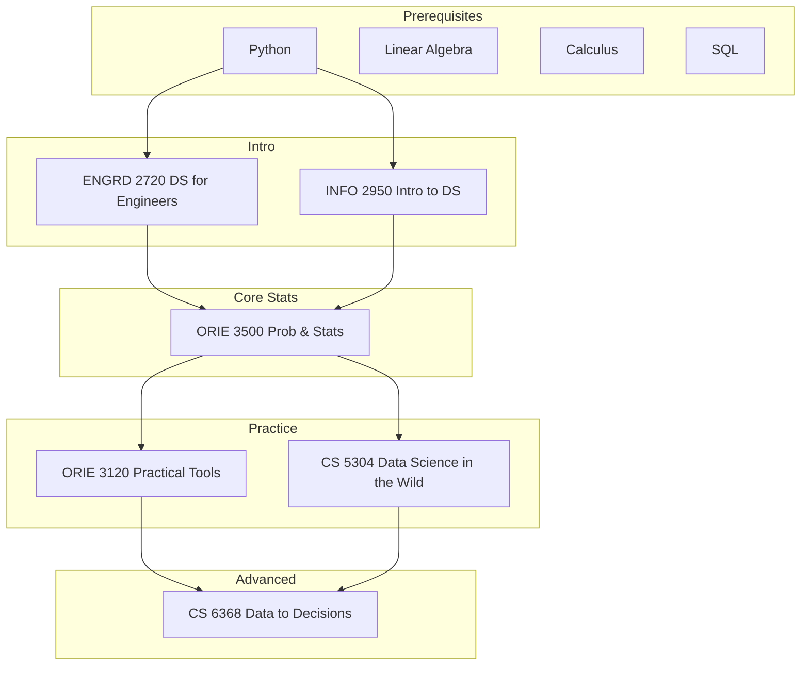

\
\
[Home]({{ '/' | relative_url }}) → [Computer Science]({{ '/csmajor/' | relative_url }}) → Data Science

# CS Major - Data Science 🔢        
Interdisciplinary field of study that uses algorithms and systems to extrapolate knowledge from data.

## Flow Map

## Prerequisite Courses:
- Programming in Python — data wrangling, numerical computing, notebooks
- Linear Algebra (e.g., MATH 2210/2940) — model representations, SVD/PCA, optimization basics
- Calculus (single & multi-variable) — gradients, optimization, continuous models
- Probability & Statistics (e.g., ORIE 3500/ENGRD 2700) — inference, estimation, hypothesis testing
- Data Structures & Algorithms — efficient processing and scalability
- SQL & Data Management basics — querying, joins, indexing, normalization

## Core Courses:  
- **ENGRD 2720 - Data Science for Engineers**
  

  
Details

  

    

    <ul>
    <li>What you'll learn: Python data stack, basic statistics, regression/classification, and end-to-end DS workflow.</li>
    <li>Essential? Yes—intro foundation for engineers entering DS/ML.</li>
    <li>Recommended workflow: Take early; build a small analysis project with proper documentation.</li>
    <li>Prereqs and why: Intro programming; basic calculus helps.</li>
    </ul>
    

  

  

- **ORIE 3500 - Engineering Probability and Statistics**
  

  
Details

  

    

    <ul>
    <li>What you'll learn: Probability, random variables, estimation, hypothesis testing—core for inference.</li>
    <li>Essential? Yes—statistics underpins DS rigor and experimentation.</li>
    <li>Recommended workflow: Before applied DS/ML courses.</li>
    <li>Prereqs and why: Calculus; comfort with algebraic manipulation.</li>
    </ul>
    

  

  

- **INFO 2950 - Intro to Data Science**
  

  
Details

  

    

    <ul>
    <li>What you'll learn: Data wrangling, EDA, visualization, modeling basics, and communication of results.</li>
    <li>Essential? Recommended if you want a broader intro with viz/communication.</li>
    <li>Recommended workflow: Early; pair with a project using real datasets.</li>
    <li>Prereqs and why: Programming fundamentals; basic stats helpful.</li>
    </ul>
    

  

  

- **CS 5304 - Data Science in the Wild**
  

  
Details

  

    

    <ul>
    <li>What you'll learn: Practical DS at scale—messy data, pipelines, experiment design, and deployment.</li>
    <li>Essential? Recommended for industry readiness.</li>
    <li>Recommended workflow: After an intro DS/ML course; focus on reproducibility.</li>
    <li>Prereqs and why: Python data stack; basic ML and SQL helpful.</li>
    </ul>
    

  

  

- **CS 6368 - Data to Decisions: Principles of Efficient Data Science**
  

  
Details

  

    

    <ul>
    <li>What you'll learn: Efficient algorithms and systems for DS; performance-aware data processing and learning.</li>
    <li>Essential? Elective bridging algorithms/systems with DS.</li>
    <li>Recommended workflow: After core DS and algorithms; profile and optimize pipelines.</li>
    <li>Prereqs and why: Algorithms, data structures, and Python/SQL tooling.</li>
    </ul>
    

  

  

- **ORIE 3120 - Practical Tools for Operations Research, Machine Learning and Data Science**
  

  
Details

  

    

    <ul>
    <li>What you'll learn: Tooling for OR/ML/DS workflows: modeling, optimization packages, and experiment management.</li>
    <li>Essential? Recommended to strengthen practical skillset.</li>
    <li>Recommended workflow: After probability/stats; apply to a capstone project.</li>
    <li>Prereqs and why: Probability/statistics; linear algebra for ML models.</li>
    </ul>
    

  

  

