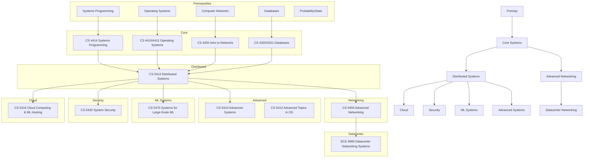

\
\
[Home]({{ '/' | relative_url }}) → [Computer Science]({{ '/csmajor/' | relative_url }}) → Distributed Systems
# CS Major - Distributed Systems 🌎
Field of study on the design, construction, and analysis of large-scale systems.

## Flow Map

## Prerequisite Courses:
- Programming and Systems Programming (C/C++/Rust) — concurrency, sockets, correctness
- Data Structures & Algorithms — complexity, correctness, distributed algorithms reasoning
- Operating Systems (concepts) — processes/threads, memory, filesystems on single nodes
- Computer Networks (intro) — TCP/IP, latency, reliability, congestion control
- Databases (intro) — transactions, isolation, indexing, query planning
- Probability/Statistics — SLAs/SLOs, reliability, backoff/retry math, performance analysis

## Core Courses:
- CS 4320 - Intro to Databases
  - What you'll learn: Relational models, SQL, transactions, indexing, and query optimization.
  - Essential? Yes—databases underpin most distributed systems.
  - Recommended workflow: Take early; build a small app with real queries and indexes.
  - Prereqs and why: Data structures/algorithms (for query plans/indexes).
- CS 4321 - Databases Practicum
  - What you'll learn: Implementation-focused DB components and advanced SQL usage.
  - Essential? Recommended to cement DB fundamentals.
  - Recommended workflow: Co-enroll with 4320; prioritize the project work.
  - Prereqs and why: 4320 concepts; strong programming.
- CS 4410 - Operating Systems
  - What you'll learn: Processes, scheduling, memory, filesystems—core for understanding nodes in a cluster.
  - Essential? Yes for backend/distributed roles.
  - Recommended workflow: Before/alongside core distributed systems.
  - Prereqs and why: C/concurrency; architecture basics.
- CS 4411 - Operating Systems Practicum
  - What you'll learn: Hands-on OS labs that map to real server behavior.
  - Essential? Recommended to deepen OS understanding.
  - Recommended workflow: With 4410.
  - Prereqs and why: C debugging, 4410.
- CS 4414 - Systems Programming
  - What you'll learn: Low-level networking, concurrency, and robust systems development.
  - Essential? Recommended setup for distributed/back-end.
  - Recommended workflow: Before 5414; build networked services.
  - Prereqs and why: Data structures; comfort with memory/concurrency.
- CS 4450 - Intro to Computer Networks
  - What you'll learn: TCP/IP, routing, congestion control, application protocols.
  - Essential? Yes—networking is the substrate for distributed systems.
  - Recommended workflow: Before or alongside 5414.
  - Prereqs and why: OS/sockets helpful; probability for performance analysis.
- CS 5414 - Distributed Systems
  - What you'll learn: Replication, consensus, fault tolerance, consistency, and distributed coordination.
  - Essential? Core course for the concentration.
  - Recommended workflow: After OS and networks; implement labs like Raft/KV store.
  - Prereqs and why: Concurrency (for correctness), networking (for RPC), algorithms (for proofs/invariants).
- CS 5416 - Cloud Computing and ML Hosting
  - What you'll learn: Cloud primitives, containers, orchestration, service meshes, ML serving.
  - Essential? Recommended for modern infra/platform roles.
  - Recommended workflow: After 5414; deploy real services on cloud-like platforms.
  - Prereqs and why: OS, networking, scripting/automation.
- CS 5430 - System Security
  - What you'll learn: Threat models, vulnerabilities, secure design, and practical defenses.
  - Essential? Recommended—security is integral to production systems.
  - Recommended workflow: Anywhere after systems programming.
  - Prereqs and why: OS and networking fundamentals.
- CS 5470 - Systems for Large-Scale Machine Learning
  - What you'll learn: Distributed training/inference, data pipelines, accelerators, and scaling ML systems.
  - Essential? Elective for ML infra/platform roles.
  - Recommended workflow: After 5414 and ML basics; run distributed experiments.
  - Prereqs and why: ML basics, OS/networking, and parallel computing helpful.
- CS 6410 - Advanced Systems
  - What you'll learn: Research papers in systems; OS, storage, networking, and distributed topics.
  - Essential? Advanced elective for research-oriented paths.
  - Recommended workflow: After 5414; replicate or extend a paper result.
  - Prereqs and why: Strong systems background; reading and experimentation skills.
- CS 6412 - Advanced Topics in Operating Systems
  - What you'll learn: Deep dives into OS topics such as virtualization, scheduling, and isolation.
  - Essential? Elective for OS-heavy interests.
  - Recommended workflow: After 4410/6410.
  - Prereqs and why: 4410 concepts; strong C and debugging.
- CS 6450 - Advanced Computer Networking
  - What you'll learn: Advanced routing, data center networks, congestion control, programmable networks.
  - Essential? Elective for network/infra specialists.
  - Recommended workflow: After 4450.
  - Prereqs and why: 4450 networking fundamentals; probability/perf analysis helpful.
- ECE 6960 - Datacenter Networking Systems 
  - What you'll learn: Data center fabrics, transport, telemetry, and reliability at scale.
  - Essential? Advanced elective for data center/network-focused roles.
  - Recommended workflow: After core networking; pair with a measurement project.
  - Prereqs and why: Strong networking and systems background.