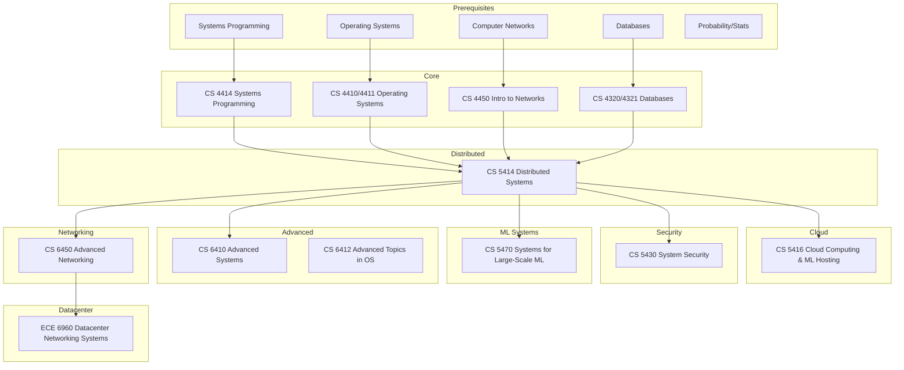

\
\
[Home]({{ '/' | relative_url }}) → [Computer Science]({{ '/csmajor/' | relative_url }}) → Distributed Systems
# CS Major - Distributed Systems 🌎
Field of study on the design, construction, and analysis of large-scale systems.

## Flow Map

## Prerequisite Courses:
- Programming and Systems Programming (C/C++/Rust) — concurrency, sockets, correctness
- Data Structures & Algorithms — complexity, correctness, distributed algorithms reasoning
- Operating Systems (concepts) — processes/threads, memory, filesystems on single nodes
- Computer Networks (intro) — TCP/IP, latency, reliability, congestion control
- Databases (intro) — transactions, isolation, indexing, query planning
- Probability/Statistics — SLAs/SLOs, reliability, backoff/retry math, performance analysis

## Core Courses:
- **CS 4320 - Intro to Databases**
  

  
Details

    <ul>
    <li>- What you'll learn: Relational models, SQL, transactions, indexing, and query optimization.</li>
    <li>- Essential? Yes—databases underpin most distributed systems.</li>
    <li>- Recommended workflow: Take early; build a small app with real queries and indexes.</li>
    <li>- Prereqs and why: Data structures/algorithms (for query plans/indexes).</li>
    </ul>
  

- **CS 4321 - Databases Practicum**
  

  
Details

    <ul>
    <li>- What you'll learn: Implementation-focused DB components and advanced SQL usage.</li>
    <li>- Essential? Recommended to cement DB fundamentals.</li>
    <li>- Recommended workflow: Co-enroll with 4320; prioritize the project work.</li>
    <li>- Prereqs and why: 4320 concepts; strong programming.</li>
    </ul>
  

- **CS 4410 - Operating Systems**
  

  
Details

    <ul>
    <li>- What you'll learn: Processes, scheduling, memory, filesystems—core for understanding nodes in a cluster.</li>
    <li>- Essential? Yes for backend/distributed roles.</li>
    <li>- Recommended workflow: Before/alongside core distributed systems.</li>
    <li>- Prereqs and why: C/concurrency; architecture basics.</li>
    </ul>
  

- **CS 4411 - Operating Systems Practicum**
  

  
Details

    <ul>
    <li>- What you'll learn: Hands-on OS labs that map to real server behavior.</li>
    <li>- Essential? Recommended to deepen OS understanding.</li>
    <li>- Recommended workflow: With 4410.</li>
    <li>- Prereqs and why: C debugging, 4410.</li>
    </ul>
  

- **CS 4414 - Systems Programming**
  

  
Details

    <ul>
    <li>- What you'll learn: Low-level networking, concurrency, and robust systems development.</li>
    <li>- Essential? Recommended setup for distributed/back-end.</li>
    <li>- Recommended workflow: Before 5414; build networked services.</li>
    <li>- Prereqs and why: Data structures; comfort with memory/concurrency.</li>
    </ul>
  

- **CS 4450 - Intro to Computer Networks**
  

  
Details

    <ul>
    <li>- What you'll learn: TCP/IP, routing, congestion control, application protocols.</li>
    <li>- Essential? Yes—networking is the substrate for distributed systems.</li>
    <li>- Recommended workflow: Before or alongside 5414.</li>
    <li>- Prereqs and why: OS/sockets helpful; probability for performance analysis.</li>
    </ul>
  

- **CS 5414 - Distributed Systems**
  

  
Details

    <ul>
    <li>- What you'll learn: Replication, consensus, fault tolerance, consistency, and distributed coordination.</li>
    <li>- Essential? Core course for the concentration.</li>
    <li>- Recommended workflow: After OS and networks; implement labs like Raft/KV store.</li>
    <li>- Prereqs and why: Concurrency (for correctness), networking (for RPC), algorithms (for proofs/invariants).</li>
    </ul>
  

- **CS 5416 - Cloud Computing and ML Hosting**
  

  
Details

    <ul>
    <li>- What you'll learn: Cloud primitives, containers, orchestration, service meshes, ML serving.</li>
    <li>- Essential? Recommended for modern infra/platform roles.</li>
    <li>- Recommended workflow: After 5414; deploy real services on cloud-like platforms.</li>
    <li>- Prereqs and why: OS, networking, scripting/automation.</li>
    </ul>
  

- **CS 5430 - System Security**
  

  
Details

    <ul>
    <li>- What you'll learn: Threat models, vulnerabilities, secure design, and practical defenses.</li>
    <li>- Essential? Recommended—security is integral to production systems.</li>
    <li>- Recommended workflow: Anywhere after systems programming.</li>
    <li>- Prereqs and why: OS and networking fundamentals.</li>
    </ul>
  

- **CS 5470 - Systems for Large-Scale Machine Learning**
  

  
Details

    <ul>
    <li>- What you'll learn: Distributed training/inference, data pipelines, accelerators, and scaling ML systems.</li>
    <li>- Essential? Elective for ML infra/platform roles.</li>
    <li>- Recommended workflow: After 5414 and ML basics; run distributed experiments.</li>
    <li>- Prereqs and why: ML basics, OS/networking, and parallel computing helpful.</li>
    </ul>
  

- **CS 6410 - Advanced Systems**
  

  
Details

    <ul>
    <li>- What you'll learn: Research papers in systems; OS, storage, networking, and distributed topics.</li>
    <li>- Essential? Advanced elective for research-oriented paths.</li>
    <li>- Recommended workflow: After 5414; replicate or extend a paper result.</li>
    <li>- Prereqs and why: Strong systems background; reading and experimentation skills.</li>
    </ul>
  

- **CS 6412 - Advanced Topics in Operating Systems**
  

  
Details

    <ul>
    <li>- What you'll learn: Deep dives into OS topics such as virtualization, scheduling, and isolation.</li>
    <li>- Essential? Elective for OS-heavy interests.</li>
    <li>- Recommended workflow: After 4410/6410.</li>
    <li>- Prereqs and why: 4410 concepts; strong C and debugging.</li>
    </ul>
  

- **CS 6450 - Advanced Computer Networking**
  

  
Details

    <ul>
    <li>- What you'll learn: Advanced routing, data center networks, congestion control, programmable networks.</li>
    <li>- Essential? Elective for network/infra specialists.</li>
    <li>- Recommended workflow: After 4450.</li>
    <li>- Prereqs and why: 4450 networking fundamentals; probability/perf analysis helpful.</li>
    </ul>
  

- **ECE 6960 - Datacenter Networking Systems**
  

  
Details

    <ul>
    <li>- What you'll learn: Data center fabrics, transport, telemetry, and reliability at scale.</li>
    <li>- Essential? Advanced elective for data center/network-focused roles.</li>
    <li>- Recommended workflow: After core networking; pair with a measurement project.</li>
    <li>- Prereqs and why: Strong networking and systems background.</li>
    </ul>
  
