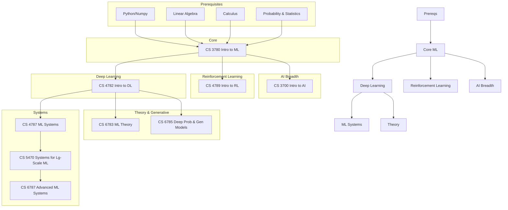

\
\
[Home]({{ '/' | relative_url }}) → [Computer Science]({{ '/csmajor/' | relative_url }}) → Machine Learning

# CS Major - Machine Learning

Machine Learning 🧠        
Field of study on how artificial intelligence algorithms learn how to perform tasks.

## Flow Map

## Prerequisite Courses:
- Programming in Python (e.g., CS 1110) — numerical computing, ML libraries, experimentation
- Linear Algebra (e.g., MATH 2210/2940) — vectors/matrices, eigens, projections; core to ML/DL
- Calculus (e.g., MATH 1920/2220) — derivatives, gradients, optimization, and vector calculus
- Probability & Statistics (e.g., ORIE 3500/ENGRD 2700) — inference, uncertainty, variance, probability distribution
- Data Structures & Algorithms — efficiency, generalization of algorithmic thinking
- Basic Optimization (e.g., ORIE 3300) — convexity, gradient methods for ML training

## Core Courses:
- **CS 3780 - Intro to Machine Learning**
  - What you'll learn: Supervised/unsupervised learning, model selection, regularization, and evaluation.
  - Essential? Yes—core ML foundations.
  - Recommended workflow: Take early; complete hands-on assignments with scikit-learn.
  - Prereqs and why: Linear algebra, probability, calculus (for optimization/gradients).
- **CS 3700 - Intro to Artificial Intelligence**
  - What you'll learn: Search, planning, probabilistic reasoning, and basic learning.
  - Essential? Recommended for breadth across AI beyond ML.
  - Recommended workflow: Before/alongside ML; implement classic AI algorithms.
  - Prereqs and why: Data structures/algorithms; discrete math.
- **CS 4782 - Intro to Deep Learning**
  - What you'll learn: Neural networks, CNNs/RNNs, training dynamics, regularization, and modern architectures.
  - Essential? Yes for DL-focused paths.
  - Recommended workflow: After intro ML; build models in PyTorch/TensorFlow.
  - Prereqs and why: Linear algebra (matrix calculus), calculus, probability; coding in Python.
- **CS 4787 - Large-Scale Machine Learning Systems**
  - What you'll learn: Distributed training/inference, data pipelines, accelerators, and systems/ML interfaces.
  - Essential? Recommended for ML systems/platform paths.
  - Recommended workflow: After DL and systems course; run distributed experiments.
  - Prereqs and why: ML fundamentals; OS/distributed basics helpful.
- **CS 4789 - Intro to Reinforcement Learning**
  - What you'll learn: MDPs, dynamic programming, TD methods, policy/value gradients, exploration.
  - Essential? Elective unless doing RL/robotics/research.
  - Recommended workflow: After ML; pair with a project in sim or control.
  - Prereqs and why: Probability, linear algebra, and optimization.
- **CS 5470 - Systems for Large-Scale Machine Learning**
  - What you'll learn: Infrastructure for ML at scale, serving, observability, and reliability.
  - Essential? Elective for MLOps/platform.
  - Recommended workflow: After ML systems exposure; deploy/monitor real services.
  - Prereqs and why: ML foundations; systems/networking helpful.
- **CS 6783 - Machine Learning Theory**
  - What you'll learn: Statistical learning theory, generalization bounds, convex optimization foundations.
  - Essential? Advanced elective for research/theory.
  - Recommended workflow: After core ML; focus on proofs and theory exercises.
  - Prereqs and why: Strong linear algebra, probability, and math maturity.
- **CS 6784 - Advanced Topics in Machine Learning**
  - What you'll learn: Rotating research topics in ML (seminar-style); reading and presenting papers.
  - Essential? Advanced elective for research-oriented paths.
  - Recommended workflow: After core ML/DL; align with an advisor/topic.
  - Prereqs and why: Core ML and strong math background.
- **CS 6785 - Deep Probabilistic and Generative Models**
  - What you'll learn: Graphical models, variational inference, VAEs/flows, and probabilistic programming.
  - Essential? Elective; key for generative modeling/research.
  - Recommended workflow: After DL; implement and evaluate generative models.
  - Prereqs and why: Probability/inference, linear algebra, and DL fundamentals.
- **CS 6787 - Advanced Machine Learning Systems**
  - What you'll learn: Advanced systems for ML—compilers for ML, scheduling, distributed runtime design.
  - Essential? Advanced elective for ML systems.
  - Recommended workflow: After 4787/5470; build or extend a systems component.
  - Prereqs and why: OS/distributed systems; ML/DL foundations.
