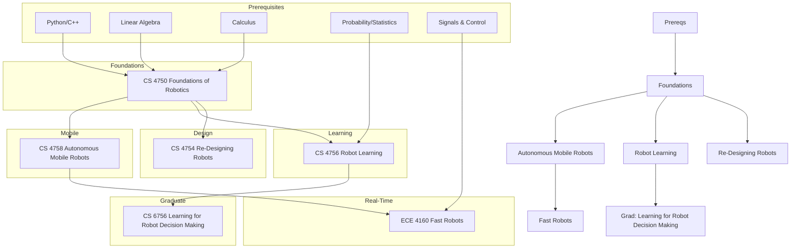

\
\
[Home]({{ '/' | relative_url }}) → [Computer Science]({{ '/csmajor/' | relative_url }}) → Robotics

# CS Major - Robotics 🤖                 
Field of interdisciplinary study on the design, construction, and deployment of physical robots and robotic automation algorithms.

## Flow Map

## Prerequisite Courses: 
- Programming in Python and C++ — for ROS, perception, and real-time control
- Linear Algebra (e.g., MATH 2210/2940) — transforms, Jacobians, projections
- Calculus (single & multi-variable) — dynamics, optimization, trajectory calculus
- Probability/Statistics (e.g., ENGRD 2700/ORIE 3500) — state estimation, sensor noise models
- Data Structures & Algorithms (e.g., CS 2110/2112) — mapping/search, planning efficiency
- Signals/Systems & Control basics — stability, filtering, feedback loop design
- Physics: Mechanics — kinematics, forces, friction impacting robot motion

## Core Courses: 
- **CS 4750 - Foundations of Robotics**
  - What you'll learn: ROS, Kinematics, dynamics, motion planning, and basic control; mathematical foundations for robot manipulators and mobile robots.
  - Essential? Yes. Forms the core math/algorithms used across perception, planning, and control.
  - Recommended workflow: Take ASAP
  - Prereqs and why: Linear algebra (for transformations/Jacobians), calculus (for dynamics), programming in Python (to use ROS).
- **CS 4754 - Re-Designing Robots**
  - What you'll learn: Human-centered robot design, prototyping, iteration, and evaluation; emphasis on system-level thinking and usability.
  - Essential? Recommended for systems perspective; complements technical courses with design/iteration skills.
  - Recommended workflow: After or alongside foundations; apply to a team project to practice rapid iteration.
  - Prereqs and why: Basic programming and some robotics exposure (to scope designs); statistics helpful for user studies.
- **CS 4756 - Robot Learning**
  - What you'll learn: Applying machine learning to robotics (imitation learning, reinforcement learning, representation learning for control/perception).
  - Essential? Optional but powerful if pursuing autonomy/perception or research.
  - Recommended workflow: After foundations; ideally after or alongside ML/RL courses (CS 3780, CS4789); run experiments in sim before on hardware.
  - Prereqs and why: Linear algebra and probability (for ML), optimization (for policy/value learning), and prior ML course (to focus on robot-specific issues).
- **CS 4758 - Autonomous Mobile Robots**
  - What you'll learn: Perception, localization, mapping, navigation stacks; end-to-end mobile robotics systems.
  - Essential? Highly recommended for mobile robotics; pairs theory with practical stacks (e.g., SLAM → Nav).
  - Recommended workflow: After foundations; integrate with ROS/ROS 2 projects; target a sim-to-real pipeline.
  - Prereqs and why: Probability/statistics (for state estimation), linear algebra (for SLAM/transformations), and data structures (for mapping/search).
- **ECE 4160 - Fast Robots**
  - What you'll learn: Real-time embedded control, sensing, and high-speed autonomy on constrained hardware.
  - Essential? Recommended if you want embedded/real-time skills or hands-on performance engineering.
  - Recommended workflow: After or alongside mobile robots; focus on control loops, timing, and hardware bring-up.
  - Prereqs and why: Signals and systems/control basics (for stability), C/C++ and microcontrollers (for real-time), physics/mechanics (for system modeling).
- **CS 6756 - Learning for Robot Decision Making**
  - What you'll learn: Advanced grad-level ML for decision-making in robotics (RL, planning under uncertainty, safety/constraints, sim-to-real).
  - Essential? Advanced elective for research-oriented or autonomy-focused paths.
  - Recommended workflow: After robot learning (CS4756) and mobile robots (SC4758); bring a research question or capstone project.
  - Prereqs and why: Strong ML (linear algebra, probability, optimization) plus robotics fundamentals (to ground algorithms in real systems).
