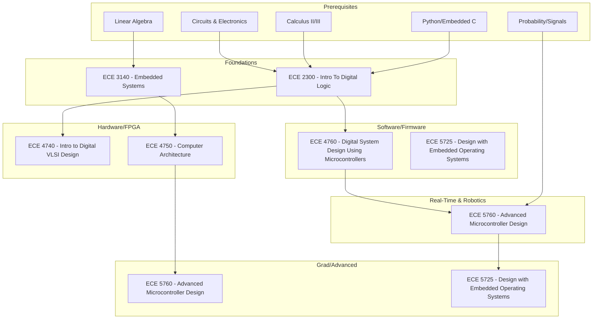

\
\
[Home]({{ '/' | relative_url }}) → [Electrical & Computer Engineering]({{ '/ecemajor/' | relative_url }}) → Embedded Systems

# ECE Major - Embedded Systems 💻       
Field of study on the design of computing systems that integrate hardware and software for real-world application. Involves the development and unification of physical components with specialized software for use within larger electronic systems.

Career Paths: Embedded Systems Engineer, FPGA Engineer, Firmware Engineer, Systems Architect, Test Engineer

## Flow Map

## Prerequisite Courses: 
- Programming in Python and Embedded C — for firmware, hardware interaction, and scripting toolchains.
- Linear Algebra — useful for sensor fusion, transforms, and control math.
- Calculus II/III — for continuous-time modeling and system analysis.
- Probability/Signals — for filtering, estimation, and handling sensor noise.
- Circuits  — for understanding sensors, power, and interfacing hardware.

## Core Courses:
- **ECE 2300 - Intro To Digital Logic**
  

  
Details

  

    

    <ul>
    <li>What you'll learn: Basics of digital circuits, Boolean logic, combinational/sequential design, and simple microcontroller I/O.</li>
    <li>Essential? Yes — foundational for embedded and hardware courses.</li>
    <li>Recommended workflow: Take early; pair with a circuits lab and small hardware projects.</li>
    <li>Prereqs and why: Intro programming and basic circuits to connect software to physical I/O.</li>
    </ul>
    

  

  

- **ECE 3140 - Embedded Systems**
  

  
Details

  

    

    <ul>
    <li>What you'll learn: Microcontrollers, assembly/embedded C, interrupts, I/O, concurrency, scheduling, and real-time constraints.</li>
    <li>Essential? Yes — core firmware knowledge for embedded roles.</li>
    <li>Recommended workflow: After ECE 2300; start hands-on projects using peripherals and debugging tools.</li>
    <li>Prereqs and why: ECE 2300 (digital logic) and programming experience to implement reliable firmware.</li>
    </ul>
    

  

  

- **ECE 4740 - Intro to Digital (VLSI) Design**
  

  
Details

  

    

    <ul>
    <li>What you'll learn: Synchronous VLSI design, CMOS logic, layout, timing, CAD tools, and electrical/performance tradeoffs.</li>
    <li>Essential? Optional — important for VLSI/ASIC career tracks.</li>
    <li>Recommended workflow: Take after digital systems or ECE 3150; pair with FPGA/HDL practice.</li>
    <li>Prereqs and why: Digital design background (ECE 3150 or equivalent) to understand layout and timing constraints.</li>
    </ul>
    

  

  

- **ECE 4750 - Computer Architecture**
  

  
Details

  

    

    <ul>
    <li>What you'll learn: Processor/memory/network building blocks, pipelining, caching, multicore design, and an RTL project workflow.</li>
    <li>Essential? Recommended for architecture, FPGA, and system-level designers.</li>
    <li>Recommended workflow: After ECE 3140/CS 3420; complete the RTL project sequence to gain practical RTL experience.</li>
    <li>Prereqs and why: HDL familiarity and digital systems background to finish the lab sequence.</li>
    </ul>
    

  

  

- **ECE 4760 - Digital System Design Using Microcontrollers**
  

  
Details

  

    

    <ul>
    <li>What you'll learn: Design of microprocessor-based real-time systems through paired lab projects focused on design, debug, and integration.</li>
    <li>Essential? Recommended for hands-on embedded system development.</li>
    <li>Recommended workflow: Take after ECE 3140; emphasize collaborative lab work.</li>
    <li>Prereqs and why: ECE 3140/CS 3420 for digital design and toolchain competence.</li>
    </ul>
    

  

  

- **ECE 5725 - Design with Embedded Operating Systems**
  

  
Details

  

    

    <ul>
    <li>What you'll learn: Embedded Linux, application and system programming on microcontroller platforms, hardware interfacing, and a semester project.</li>
    <li>Essential? Recommended for Linux-based embedded development and system integration work.</li>
    <li>Recommended workflow: After ECE 3140; build end-to-end projects on Raspberry Pi–like targets.</li>
    <li>Prereqs and why: ECE 3140/CS 3420 to ensure students can handle system-level programming and hardware interfaces.</li>
    </ul>
    

  

  

- **ECE 5760 - Advanced Microcontroller Design**
  

  
Details

  

    

    <ul>
    <li>What you'll learn: SoC/advanced microcontroller design, custom peripherals, RTOS integration, and HW/SW co-design in labs.</li>
    <li>Essential? Recommended for SoC/FPGA specialization and hardware-accelerated systems.</li>
    <li>Recommended workflow: After foundational digital/embedded courses; integrate HW/SW projects.</li>
    <li>Prereqs and why: Recommended ECE 5725 and prior HDL/digital experience for reliable SoC development.</li>
    </ul>
    

  

  

