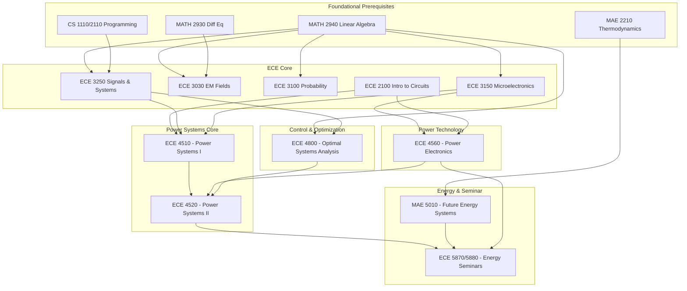

\
\
[Home]({{ '/' | relative_url }}) → [Electrical & Computer Engineering]({{ '/ecemajor/' | relative_url }}) → Power Systems
# ECE Major - Power Systems 🔌        
Field of study on the generation, transmission, distribution, and control of electrical power. Involves designing, analyzing, and maintaining function of power systems.

Career Paths: Power Systems Engineer, Transmission Line Design Engineer, Field Service Engineer, Power Electronics Engineer, Controls Engineer

## Flow Map

## Prerequisite Courses:
- Programming in Python/Matlab (CS 1110/1112) — for simulations, scripting power‑flow tools, and numerical experiments.
- Linear Algebra (MATH 2940) — for network matrices, modal analysis, and optimization foundations.
- Calculus II, III (MATH 1910, 1920) — for continuous modeling, differential equations, and numerical methods.
- Thermodynamics* (ENGRD 2210) — useful for MAE 5010 and understanding energy conversion/efficiency.
- Probability (ECE 3100) — for uncertainty modeling, load forecasting, and state estimation.
- Signals & Systems (ECE 3250) — for control, filtering, and system dynamics.
- Circuits (ECE 2100) — for basic network models and component behavior in power systems.

*Mainly for MAE 5010

## Helpful Non-Core Courses:
- Microelectronics (ECE 3150) — useful for device‑level understanding relevant to power electronics and converter design.

## Core Courses:   

- **ECE 2100 - Intro to Circuits**
  

  
Details

  

    

    <ul>
    <li>What you'll learn: Basic network models and component behavior in power systems.</li>
    <li>Essential? Yes. Foundational for all ECE specializations.</li>
    <li>Recommended workflow: Take as early as possible.</li>
    <li>Prereqs and why: Basic physics and calculus.</li>
    </ul>
    

  

  

- **ECE 3030 - EM Fields**
  

  
Details

  

    

    <ul>
    <li>What you'll learn: Electromagnetic wave propagation and its application.</li>
    <li>Essential? Recommended for understanding transmission lines and high-frequency effects.</li>
    <li>Recommended workflow: Take after foundational math and physics.</li>
    <li>Prereqs and why: MATH 2940, MATH 2930.</li>
    </ul>
    

  

  

- **ECE 3100 - Probability**
  

  
Details

  

    

    <ul>
    <li>What you'll learn: Uncertainty modeling, load forecasting, and state estimation.</li>
    <li>Essential? Yes, for advanced topics in power systems.</li>
    <li>Recommended workflow: Take alongside other core ECE courses.</li>
    <li>Prereqs and why: MATH 2940.</li>
    </ul>
    

  

  

- **ECE 3250 - Signals & Systems**
  

  
Details

  

    

    <ul>
    <li>What you'll learn: Control, filtering, and system dynamics.</li>
    <li>Essential? Yes, provides the mathematical foundation for power systems analysis.</li>
    <li>Recommended workflow: Take after foundational math courses.</li>
    <li>Prereqs and why: MATH 2940, CS 1110/2110.</li>
    </ul>
    

  

  

- **ECE 3150 - Microelectronics**
  

  
Details

  

    

    <ul>
    <li>What you'll learn: Device-level understanding relevant to power electronics and converter design.</li>
    <li>Essential? Highly recommended for power electronics.</li>
    <li>Recommended workflow: Take after introductory circuits.</li>
    <li>Prereqs and why: ECE 2100, MATH 2940.</li>
    </ul>
    

  

  

- **ECE 4800 - Optimal Systems Analysis**
  

  
Details

  

    

    <ul>
    <li>What you'll learn: Optimization theory and algorithms for system analysis and design — linear programming, convex programming, duality, and applied examples (networks, control, circuits, signal processing).</li>
    <li>Essential? Recommended for analytical foundations used across power systems and control problems.</li>
    <li>Recommended workflow: Take early once calculus/linear algebra background is solid; use alongside applied systems courses.</li>
    <li>Prereqs and why: Linear algebra and calculus (for convex analysis and algorithm derivations); programming helpful for implementations.</li>
    </ul>
    

  

  

- **ECE 4510 - Power Systems I**
  

  
Details

  

    

    <ul>
    <li>What you'll learn: Power system modeling and analysis — transmission line models, transformers and per‑unit systems, generator models, network matrices, power flow analysis, real/reactive power control, and voltage control.</li>
    <li>Essential? Yes. Forms the baseline course for further power systems study.</li>
    <li>Recommended workflow: Take as an early core course for the power track; follow with Power Systems II and power electronics.</li>
    <li>Prereqs and why: Circuits and signals (for network models), linear algebra (for network matrices), programming (for power flow computation).</li>
    </ul>
    

  

  

- **ECE 4560 - Power Electronics**
  

  
Details

  

    

    <ul>
    <li>What you'll learn: Analysis and design of power converters — semiconductor device modeling, thermal and magnetic component modeling, EMI filter design, and switching converter control.</li>
    <li>Essential? Recommended for students pursuing power conversion or hardware-focused roles.</li>
    <li>Recommended workflow: Take after basic circuits and some power systems exposure; complement with lab/project work.</li>
    <li>Prereqs and why: Circuits and microelectronics background (device and component models); control basics helpful for converter control design.</li>
    </ul>
    

  

  

- **ECE 4520 - Power Systems II**
  

  
Details

  

    

    <ul>
    <li>What you'll learn: Power system operations, smart grid concepts, electricity markets — power flow analysis, economic dispatch, optimal power flow, unit commitment, demand response, and transactive energy.</li>
    <li>Essential? Yes for students interested in operations, markets, and grid-level analysis.</li>
    <li>Recommended workflow: After Power Systems I; pair with optimization coursework for OPF/dispatch topics.</li>
    <li>Prereqs and why: Power Systems I and optimization (for economic dispatch and OPF); programming for simulations and market analysis.</li>
    </ul>
    

  

  

- **ECE 5870 - Energy Seminar I**
  

  
Details

  

    

    <ul>
    <li>What you'll learn: Broad energy topics — generation technologies, storage, environmental impacts, policy, and system economics via guest speakers and case studies.</li>
    <li>Essential? Useful for breadth and industry perspective; good for networking.</li>
    <li>Recommended workflow: Take anytime during the major, especially when exploring career directions.</li>
    <li>Prereqs and why: No strict technical prereqs; prior energy or systems exposure improves seminar discussions.</li>
    </ul>
    

  

  

- **ECE 5880 - Energy Seminar II**
  

  
Details

  

    

    <ul>
    <li>What you'll learn: Continued exploration of contemporary energy topics, policy, and technologies with varied speakers.</li>
    <li>Essential? Useful for continued breadth and exposure to current industry/research topics.</li>
    <li>Recommended workflow: Follow 5870 or take in a later term to deepen topical understanding.</li>
    <li>Prereqs and why: Similar to 5870; background in core energy concepts helps.</li>
    </ul>
    

  

  

- **MAE 5010 - Future Energy Systems**
  

  
Details

  

    

    <ul>
    <li>What you'll learn: Analysis of renewable and other low‑carbon energy systems — capacity, efficiency, productivity, and economics; systems-level tradeoffs and policies.</li>
    <li>Essential? Recommended for students interested in energy systems, renewables, and policy intersection.</li>
    <li>Recommended workflow: Take after core power/energy exposure; useful for capstone or research in energy systems.</li>
    <li>Prereqs and why: Thermodynamics and basic power/energy background (for device/system analysis); economics/policy familiarity helpful but not mandatory.</li>
    </ul>
    

  

  
