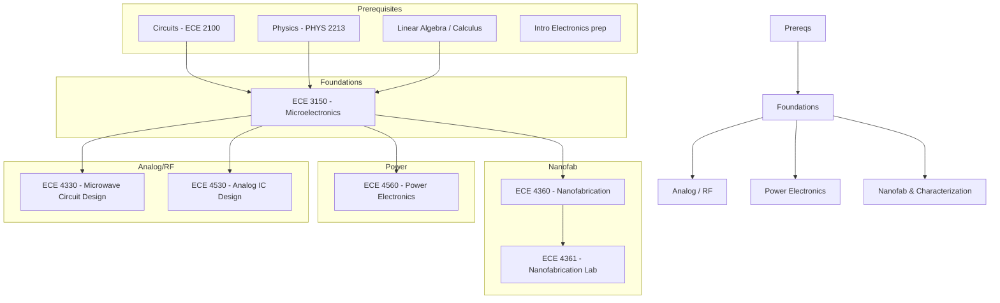

\
\
[Home]({{ '/' | relative_url }}) → [Electrical & Computer Engineering]({{ '/ecemajor/' | relative_url }}) → Analog and RF Circuit Design
# ECE Major - Analog and RF Circuit Design ⚡        
Field of study focused on the design and innovation of electronic systems and integrated circuits for efficiency and functionality in modern technology.

## Flow Map

## Prerequisite Courses:
- **Circuits (ECE 2100/ENGRD 2100)** — basic circuit analysis used everywhere in analog/RF/power work.
- **Physics (PHYS 2213)** — semiconductor/solid-state fundamentals for device-level understanding.
- **Calculus & Linear Algebra** — continuous modeling, small-signal analysis, and matrix methods in circuits.
- **Intro electronics / prior device exposure** — helps when starting ECE 3150 and higher-level IC or RF design.

## Core Courses:
- **ECE 3150 - Microelectronics**
  

  
Details

    <ul>
    <li>- What you'll learn: Semiconductor physics, PN junctions, MOS/BJT device models, small‑signal analysis, single/multi‑stage amplifiers, high‑frequency models, CMOS logic, and lab/project work.</li>
    <li>- Essential? Yes — the primary foundation for analog, RF, and power-electronics topics.</li>
    <li>- Recommended workflow: Take early after circuits and physics; use labs to build device intuition.</li>
    <li>- Prereqs and why: ECE 2100/PHYS 2213 to understand device operation and circuit-level implications.</li>
    </ul>
  

- **ECE 4330 - Microwave Circuit Design**
  

  
Details

    <ul>
    <li>- What you'll learn: Planar transmission lines, network analysis, S‑parameters, matching networks, resonators, filters, power dividers, and microwave measurement/simulation workflows.</li>
    <li>- Essential? Recommended for RF/mm‑wave and high‑frequency design specializations.</li>
    <li>- Recommended workflow: After ECE 3150 and E&M fundamentals; pair with hands‑on measurement or EM simulation projects.</li>
    <li>- Prereqs and why: ECE 3030 (electromagnetics) and ECE 3150 to connect device/circuit behavior with wave/line phenomena.</li>
    </ul>
  

- **ECE 4360 - Nanofabrication and Characterization of Electronics**
  

  
Details

    <ul>
    <li>- What you'll learn: Nanofabrication processes (lithography, metallization, etching, annealing), device fabrication steps, process modeling, and integration considerations for IC manufacturing.</li>
    <li>- Essential? Optional — important if you plan to work on fabrication, device research, or integration challenges.</li>
    <li>- Recommended workflow: After ECE 3150; take the paired lab (ECE 4361) to get hands‑on fabrication experience.</li>
    <li>- Prereqs and why: MSE 2620 or ECE 3150 and supporting math/chemistry to understand process physics and device behavior.</li>
    </ul>
  

- **ECE 4361 - Nanofabrication and Characterization Lab**
  

  
Details

    <ul>
    <li>- What you'll learn: Hands‑on fabrication and characterization of devices (diodes, MOS capacitors, MOSFETs, 2D/GaN devices), cleanroom workflows, and measurement techniques.</li>
    <li>- Essential? Recommended if pursuing device/process work; complements ECE 4360.</li>
    <li>- Recommended workflow: Take alongside or after ECE 4360; focus on lab safety and process sequence mastery.</li>
    <li>- Prereqs and why: Core fabrication lecture background (ECE 4360 or equivalent) to meaningfully perform and interpret lab work.</li>
    </ul>
  

- **ECE 4530 - Analog Integrated Circuit Design**
  

  
Details

    <ul>
    <li>- What you'll learn: Transistor‑level design for linear analog ICs — single‑stage amplifiers, current mirrors, differential pairs, op‑amp design, and layout techniques for analog circuits.</li>
    <li>- Essential? Yes for students targeting analog IC design roles.</li>
    <li>- Recommended workflow: After ECE 3150; perform transistor‑level design labs and layout assignments.</li>
    <li>- Prereqs and why: ECE 3150 provides device models and small‑signal tools used in IC design.</li>
    </ul>
  

- **ECE 4560 - Power Electronics**
  

  
Details

    <ul>
    <li>- What you'll learn: Modeling and design of power converters, semiconductor device modeling for power switches, thermal/magnetic/component modeling, EMI filtering, and switching converter control.</li>
    <li>- Essential? Recommended for students interested in power conversion and energy systems.</li>
    <li>- Recommended workflow: After ECE 3150 and circuits; pair with lab or project work on converters and control.</li>
    <li>- Prereqs and why: ECE 3150 or instructor permission to ensure familiarity with device behavior and non‑linear converter analysis.</li>
    </ul>
  

## Relevant / Additional Notes:
- Use ECE 3150 as the central foundation and pick downstream courses depending on specialization: RF (4330, 4530), Power (4560), or Fabrication (4360/4361).