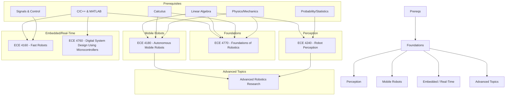

\
\
[Home]({{ '/' | relative_url }}) → [Electrical & Computer Engineering]({{ '/ecemajor/' | relative_url }}) → Robotics

# ECE Major - Robotics 🤖                 
Field of interdisciplinary study on the design, construction, and deployment of physical robots and robotic automation algorithms.

## Flow Map

## Prerequisite Courses:
- C/C++ & MATLAB programming — for embedded control, ROS, and real-time systems.
- Linear Algebra — for kinematics, Jacobians, transformations, and state estimation.
- Calculus (single & multi-variable) — for dynamics, trajectory planning, and optimization.
- Probability/Statistics — for sensor fusion, state estimation, and noise modeling.
- Signals & Control basics — for feedback control, filtering, and system stability.
- Physics: Mechanics — for kinematics, forces, friction, and robot dynamics.

## Core Courses:
- **ECE 4160 - Fast Robots**
  - What you'll learn: Real-time embedded control, sensing, and high-speed autonomy on constrained hardware; dynamic behaviors, reactive control on microcontrollers.
  - Essential? Recommended for embedded/real-time robotics and performance-critical systems.
  - Recommended workflow: After or alongside foundational robotics; focus on control loops, timing, hardware debugging, and rapid prototyping.
  - Prereqs and why: Signals/control basics (for stability), C/C++ and microcontroller experience (for real-time), physics/mechanics (for system modeling).

- **ECE 4180 - Autonomous Mobile Robots**
  - What you'll learn: Sensing, perception, localization, mapping, path planning, motion planning, obstacle avoidance, and multi-robot control techniques.
  - Essential? Highly recommended for mobile robotics; comprehensive overview of end-to-end autonomous systems.
  - Recommended workflow: After or alongside ECE 4770; pair with practical implementations and simulation.
  - Prereqs and why: MATLAB programming and foundational robotics knowledge (kinematics, planning concepts).

- **ECE 4240 - Robot Perception**
  - What you'll learn: Sensor fusion, intelligent processing of heterogeneous sensor measurements, artificial vision, acoustic sensing, filtering, neural/Bayesian networks, and information theory for robotics.
  - Essential? Recommended for perception-heavy applications and sensor integration work.
  - Recommended workflow: After ECE 4770 (foundations); pair with signal processing and machine learning.
  - Prereqs and why: ENGRD 2112, MATH 2940, MATH 4710 (or equivalent probability/statistics) for filtering and Bayesian methods.

- **ECE 4760 - Digital System Design Using Microcontrollers**
  - What you'll learn: Real-time digital system design using microprocessor-based embedded controllers; design, debug, and implementation of small systems through lab work.
  - Essential? Recommended for hands-on embedded robotics and microcontroller programming.
  - Recommended workflow: After or alongside ECE 4160; emphasize collaborative lab work and practical system integration.
  - Prereqs and why: ECE 3140/CS 3420 for digital design foundations and toolchain competence.

- **ECE 4770 - Foundations of Robotics**
  - What you'll learn: Computational fundamentals for robotics — kinematics, state estimation, motion planning, and controls; mathematical foundations and how sub-fields integrate into intelligent robot behavior.
  - Essential? Yes. Core introduction to robotics theory and algorithms across all specializations.
  - Recommended workflow: Take early as the foundation course; use theoretical and programming exercises to build intuition.
  - Prereqs and why: CS 1112, CS 2110, CS 2800, MATH 1920, MATH 2940 (programming, algorithms, and math fundamentals for kinematics/planning).