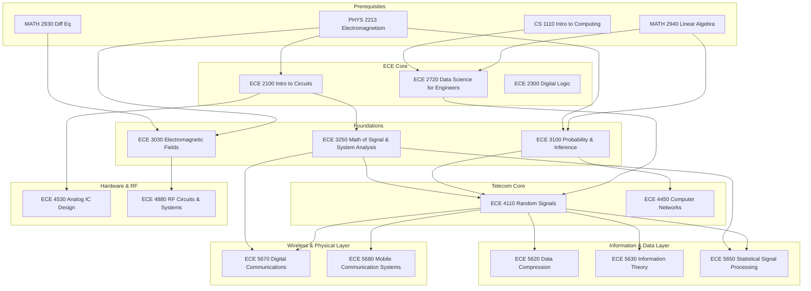

\
\
[Home]({{ '/' | relative_url }}) → [Electrical & Computer Engineering]({{ '/ecemajor/' | relative_url }}) → Telecommunications
# ECE Major - Telecommunications 📡
Field of study focused on the transmission of information over long distances via electrical or electronic means. Involves the design and development of communication systems using cables, radio waves, digital networks and other technologies. 

Career Paths: Telecommunications Engineer, Network Engineer, RF Engineer, Satellite Engineer, Signal Processing Engineer

## Flow Map

## Prerequisite Courses:
- Signals & Systems (e.g., ECE 3250) — fundamentals for time/frequency analysis and system response.
- Probability & Statistics (e.g., ECE 3100) — for noise modeling, detection, estimation, and BER analysis.
- Linear Algebra — for MIMO, transforms, and spectral methods.
- Calculus (single & multi-variable) — for continuous-time models and transforms.
- Programming in Python/Matlab — for simulation, algorithm prototyping, and signal analysis.

## Core Courses:
- **ECE 2100 - Intro to Circuits**
  

  
Details

  

    

    <ul>
    <li>What you'll learn: Fundamentals of circuit analysis.</li>
    <li>Essential? Yes.</li>
    <li>Recommended workflow: Take early.</li>
    <li>Prereqs and why: PHYS 2213.</li>
    </ul>
    

  

  

- **ECE 2300 - Digital Logic**
  

  
Details

  

    

    <ul>
    <li>What you'll learn: Design and analysis of digital logic circuits.</li>
    <li>Essential? Yes, for hardware-level understanding.</li>
    <li>Recommended workflow: Take after introductory programming.</li>
    <li>Prereqs and why: CS 1110.</li>
    </ul>
    

  

  

- **ECE 2720 - Data Science for Engineers**
  

  
Details

  

    

    <ul>
    <li>What you'll learn: Data science techniques and applications in engineering.</li>
    <li>Essential? Recommended for data-driven fields.</li>
    <li>Recommended workflow: Take after foundational math and programming.</li>
    <li>Prereqs and why: MATH 2940, CS 1110.</li>
    </ul>
    

  

  

- **ECE 3030 - Electromagnetic Fields**
  

  
Details

  

    

    <ul>
    <li>What you'll learn: Theory of electromagnetic fields and waves.</li>
    <li>Essential? Yes, for understanding signal propagation.</li>
    <li>Recommended workflow: Take after advanced math courses.</li>
    <li>Prereqs and why: MATH 2930, PHYS 2213.</li>
    </ul>
    

  

  

- **ECE 3100 - Probability and Inference**
  

  
Details

  

    

    <ul>
    <li>What you'll learn: Probability models, distributions, expectation/variance, limit theorems, Monte Carlo, and basics of statistical inference for engineering problems.</li>
    <li>Essential? Yes — underpins detection, estimation, and coding analyses used across telecom.</li>
    <li>Recommended workflow: Take early; use immediately for communications and signal-processing classes.</li>
    <li>Prereqs and why: Math background (MATH 2940) to follow rigorous probability and inference concepts.</li>
    </ul>
    

  

  

- **ECE 3250 - Signals and Systems**
  

  
Details

  

    

    <ul>
    <li>What you'll learn: Continuous/discrete-time analysis, convolution, Fourier transforms, sampling theory, DFT/FFT, and spectral methods.</li>
    <li>Essential? Yes — core for all physical and baseband communication analysis.</li>
    <li>Recommended workflow: Take early and pair with computational assignments (MATLAB/Python).</li>
    <li>Prereqs and why: Calculus and linear algebra to derive transforms and system properties.</li>
    </ul>
    

  

  

- **ECE 4110 - Random Signals in Communications**
  

  
Details

  

    

    <ul>
    <li>What you'll learn: Random process models, Markov/Poisson/queueing fundamentals, PSDs, and linear system responses to random inputs; applications to estimation and inference in comms.</li>
    <li>Essential? Recommended for deeper understanding of noise and stochastic behavior in links.</li>
    <li>Recommended workflow: After probability and signals; apply to channel/noise modeling in projects.</li>
    <li>Prereqs and why: ECE 3100 and ECE 3250 to connect stochastic models with system responses.</li>
    </ul>
    

  

  

- **ECE 4150 - GPS: Theory and Design**
  

  
Details

  

    

    <ul>
    <li>What you'll learn: GPS orbital dynamics, receiver/antenna characteristics, navigation algorithms, error analysis, and differential GPS techniques.</li>
    <li>Essential? Recommended for positioning/remote-sensing and navigation work.</li>
    <li>Recommended workflow: Take after foundational communications/math courses; include a culminating design exercise.</li>
    <li>Prereqs and why: Advanced math/engineering course background to handle orbital and estimation math.</li>
    </ul>
    

  

  

- **ECE 4450 - Computer Networks and Telecommunications**
  

  
Details

  

    

    <ul>
    <li>What you'll learn: Networking principles with emphasis on wireless tech (cellular, WiFi, Bluetooth), routing/switching, congestion control, and security/privacy impacts.</li>
    <li>Essential? Recommended for systems and network-focused telecom careers.</li>
    <li>Recommended workflow: After core comms and probability courses; combine with networking projects or seminars.</li>
    <li>Prereqs and why: ECE 3100 or equivalent probability knowledge to reason about traffic and stochastic behaviors.</li>
    </ul>
    

  

  

- **ECE 4530 - Analog IC Design**
  

  
Details

  

    

    <ul>
    <li>What you'll learn: Design of analog integrated circuits.</li>
    <li>Essential? Recommended for hardware and RF roles.</li>
    <li>Recommended workflow: Take after introductory circuits.</li>
    <li>Prereqs and why: ECE 2100.</li>
    </ul>
    

  

  

- **ECE 4880 - RF Circuits & Systems**
  

  
Details

  

    

    <ul>
    <li>What you'll learn: Design of radio-frequency circuits and systems.</li>
    <li>Essential? Yes, for RF and wireless hardware roles.</li>
    <li>Recommended workflow: Take after EM fields and circuits.</li>
    <li>Prereqs and why: ECE 3030.</li>
    </ul>
    

  

  

- **ECE 5620 - Data Compression**
  

  
Details

  

    

    <ul>
    <li>What you'll learn: Theory and algorithms for data compression.</li>
    <li>Essential? Recommended for information theory specialization.</li>
    <li>Recommended workflow: Take after random signals.</li>
    <li>Prereqs and why: ECE 4110.</li>
    </ul>
    

  

  

- **ECE 5630 - Information Theory**
  

  
Details

  

    

    <ul>
    <li>What you'll learn: Fundamental limits of data compression and transmission.</li>
    <li>Essential? Yes, for advanced communication theory.</li>
    <li>Recommended workflow: Take after random signals.</li>
    <li>Prereqs and why: ECE 4110.</li>
    </ul>
    

  

  

- **ECE 5650 - Statistical Signal Processing**
  

  
Details

  

    

    <ul>
    <li>What you'll learn: Advanced signal processing techniques based on statistical models.</li>
    <li>Essential? Recommended for signal processing roles.</li>
    <li>Recommended workflow: Take after random signals and systems analysis.</li>
    <li>Prereqs and why: ECE 4110, ECE 3250.</li>
    </ul>
    

  

  

- **ECE 5670 - Digital Communications**
  

  
Details

  

    

    <ul>
    <li>What you'll learn: Design and analysis of digital communication systems.</li>
    <li>Essential? Yes, for core telecom roles.</li>
    <li>Recommended workflow: Take after random signals and systems analysis.</li>
    <li>Prereqs and why: ECE 4110, ECE 3250.</li>
    </ul>
    

  

  

- **ECE 5680 - Mobile Communication Systems**
  

  
Details

  

    

    <ul>
    <li>What you'll learn: Principles of mobile and wireless communication systems.</li>
    <li>Essential? Yes, for wireless communication roles.</li>
    <li>Recommended workflow: Take after random signals.</li>
    <li>Prereqs and why: ECE 4110.</li>
    </ul>
    

  

  

- **ECE 4670 - Digital Communication System Design**
  

  
Details

  

    

    <ul>
    <li>What you'll learn: Practical transceiver algorithms, OFDM-based system design, wireless-channel considerations, and implementation of a working communication system.</li>
    <li>Essential? Yes for hands-on digital comms and modern wireless system design.</li>
    <li>Recommended workflow: After ECE 3250 and ECE 2720; implement BER simulations and OFDM projects.</li>
    <li>Prereqs and why: DSP and signals background to design reliable digital links under channel impairments.</li>
    </ul>
    

  

  

- **ECE 4870 - Introduction to Radar Remote Sensing**
  

  
Details

  

    

    <ul>
    <li>What you'll learn: Radar fundamentals, antennas, remote sensing principles, radar signal processing, and application-specific performance analysis.</li>
    <li>Essential? Recommended for radar/remote-sensing specializations and aerospace/EO applications.</li>
    <li>Recommended workflow: After physics and signals; pair with antenna/propagation exposure.</li>
    <li>Prereqs and why: PHYS 2208/2213 and signals to understand wave propagation and system response.</li>
    </ul>
    

  

  

