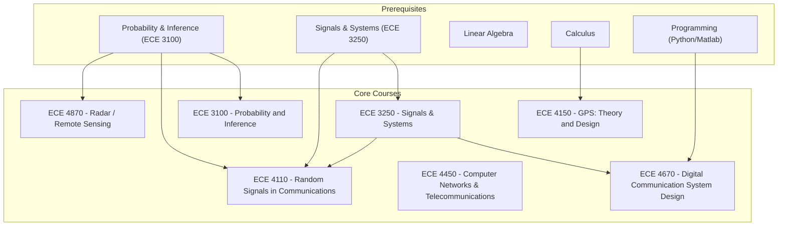

\
\
[Home]({{ '/' | relative_url }}) → [Electrical & Computer Engineering]({{ '/ecemajor/' | relative_url }}) → Telecommunications
# ECE Major - Telecommunications 📡
Field of study focused on the transmission of information over long distances via electrical or electronic means. Involves the design and development of communication systems using cables, radio waves, digital networks and other technologies. 

Career Paths: Telecommunications Engineer, Network Engineer, RF Engineer, Satellite Engineer, Signal Processing Engineer

## Flow Map

## Prerequisite Courses:
- Signals & Systems (e.g., ECE 3250) — fundamentals for time/frequency analysis and system response.
- Probability & Statistics (e.g., ECE 3100) — for noise modeling, detection, estimation, and BER analysis.
- Linear Algebra — for MIMO, transforms, and spectral methods.
- Calculus (single & multi-variable) — for continuous-time models and transforms.
- Programming in Python/Matlab — for simulation, algorithm prototyping, and signal analysis.

## Core Courses:
- **ECE 3100 - Probability and Inference**
  - What you'll learn: Probability models, distributions, expectation/variance, limit theorems, Monte Carlo, and basics of statistical inference for engineering problems.
  - Essential? Yes — underpins detection, estimation, and coding analyses used across telecom.
  - Recommended workflow: Take early; use immediately for communications and signal-processing classes.
  - Prereqs and why: Math background (MATH 2940) to follow rigorous probability and inference concepts.

- **ECE 3250 - Signals and Systems**
  - What you'll learn: Continuous/discrete-time analysis, convolution, Fourier transforms, sampling theory, DFT/FFT, and spectral methods.
  - Essential? Yes — core for all physical and baseband communication analysis.
  - Recommended workflow: Take early and pair with computational assignments (MATLAB/Python).
  - Prereqs and why: Calculus and linear algebra to derive transforms and system properties.

- **ECE 4110 - Random Signals in Communications**
  - What you'll learn: Random process models, Markov/Poisson/queueing fundamentals, PSDs, and linear system responses to random inputs; applications to estimation and inference in comms.
  - Essential? Recommended for deeper understanding of noise and stochastic behavior in links.
  - Recommended workflow: After probability and signals; apply to channel/noise modeling in projects.
  - Prereqs and why: ECE 3100 and ECE 3250 to connect stochastic models with system responses.

- **ECE 4150 - GPS: Theory and Design**
  - What you'll learn: GPS orbital dynamics, receiver/antenna characteristics, navigation algorithms, error analysis, and differential GPS techniques.
  - Essential? Recommended for positioning/remote-sensing and navigation work.
  - Recommended workflow: Take after foundational communications/math courses; include a culminating design exercise.
  - Prereqs and why: Advanced math/engineering course background to handle orbital and estimation math.

- **ECE 4450 - Computer Networks and Telecommunications**
  - What you'll learn: Networking principles with emphasis on wireless tech (cellular, WiFi, Bluetooth), routing/switching, congestion control, and security/privacy impacts.
  - Essential? Recommended for systems and network-focused telecom careers.
  - Recommended workflow: After core comms and probability courses; combine with networking projects or seminars.
  - Prereqs and why: ECE 3100 or equivalent probability knowledge to reason about traffic and stochastic behaviors.

- **ECE 4670 - Digital Communication System Design**
  - What you'll learn: Practical transceiver algorithms, OFDM-based system design, wireless-channel considerations, and implementation of a working communication system.
  - Essential? Yes for hands-on digital comms and modern wireless system design.
  - Recommended workflow: After ECE 3250 and ECE 2720; implement BER simulations and OFDM projects.
  - Prereqs and why: DSP and signals background to design reliable digital links under channel impairments.

- **ECE 4870 - Introduction to Radar Remote Sensing**
  - What you'll learn: Radar fundamentals, antennas, remote sensing principles, radar signal processing, and application-specific performance analysis.
  - Essential? Recommended for radar/remote-sensing specializations and aerospace/EO applications.
  - Recommended workflow: After physics and signals; pair with antenna/propagation exposure.
  - Prereqs and why: PHYS 2208/2213 and signals to understand wave propagation and system response.

