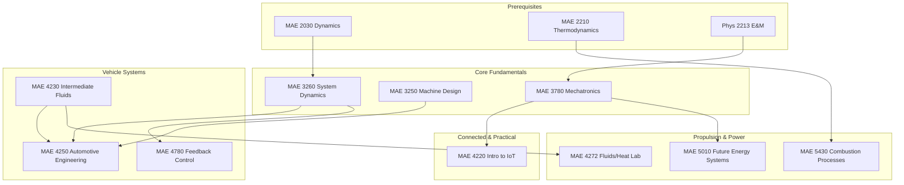

\
\
[Home]({{ '/' | relative_url }}) → [Mechanical Engineering]({{ '/maemajor/' | relative_url }}) → Automotive & EV Engineering
# MAE Major - Automotive & EV Engineering 🏎️
Specialized study on the dynamics and propulsion of ground vehicles. Focuses on vehicle stability, electric powertrains, internal combustion, and the integration of IoT/sensors for modern connected vehicles.

## Flow Map

## Prerequisite Courses:
- **Dynamics** — Newton’s laws, rigid body kinematics, and kinetics (essential for vehicle stability).
- **Thermodynamics** — Power cycles, efficiency, and heat engines (ICE and battery thermal management).
- **Physics (E&M)** — Circuits and electromagnetic fields (critical for EV motors).

## Core Courses:

- **MAE 4250 - Automotive Engineering**
  

  
Details

  

    

    <ul>
    <li>What you'll learn: Vehicle performance (acceleration/braking), handling/cornering stability, tire mechanics, and suspension design.</li>
    <li>Essential? Yes—this is the definitive course for the track.</li>
    <li>Recommended workflow: Senior Fall.</li>
    <li>Prereqs and why: System Dynamics (modeling mass-spring-damper).</li>
    </ul>
    

  

  

- **MAE 3260 - System Dynamics**
  

  
Details

  

    

    <ul>
    <li>What you'll learn: Mathematical modeling of suspension systems, vibration isolation, and frequency response of mechanical systems.</li>
    <li>Essential? Yes—fundamental for understanding ride quality and stability.</li>
    <li>Recommended workflow: Junior year.</li>
    <li>Prereqs and why: Dynamics, Diff Eq.</li>
    </ul>
    

  

  

- **MAE 3250 - Analysis of Mechanical & Aerospace Structures (Machine Design)**
  

  
Details

  

    

    <ul>
    <li>What you'll learn: Stress analysis, fatigue failure, gears, bearings, and transmission component design.</li>
    <li>Essential? Critical for chassis and powertrain mechanical design.</li>
    <li>Recommended workflow: Junior year.</li>
    <li>Prereqs and why: Statics/Mechanics of Materials.</li>
    </ul>
    

  

  

- **MAE 5430 - Combustion Processes**
  

  
Details

  

    

    <ul>
    <li>What you'll learn: Internal combustion engine (ICE) cycles, flame propagation, knock, and emissions control.</li>
    <li>Essential? Yes for traditional automotive and hybrid powertrains.</li>
    <li>Recommended workflow: Senior/M.Eng.</li>
    <li>Prereqs and why: Thermodynamics.</li>
    </ul>
    

  

  

- **MAE 5010 - Future Energy Systems**
  

  
Details

  

    

    <ul>
    <li>What you'll learn: Battery chemistry, energy storage density, fuel cells, and electric grid integration for EVs.</li>
    <li>Essential? Critical for Electric Vehicle (EV) specialization.</li>
    <li>Recommended workflow: Senior Spring.</li>
    <li>Prereqs and why: Thermodynamics.</li>
    </ul>
    

  

  

- **MAE 4780 - Feedback Control Systems**
  

  
Details

  

    

    <ul>
    <li>What you'll learn: PID control, cruise control logic, lane-keeping algorithms, and stability augmentation.</li>
    <li>Essential? Highly recommended for ADAS (Advanced Driver Assistance Systems).</li>
    <li>Recommended workflow: Senior Fall.</li>
    <li>Prereqs and why: System Dynamics.</li>
    </ul>
    

  

  

- **MAE 4230 - Intermediate Fluid Mechanics**
  

  
Details

  

    

    <ul>
    <li>What you'll learn: Aerodynamic drag reduction, boundary layers, and airflow over bodies (vehicle exterior aerodynamics).</li>
    <li>Essential? Key for performance and fuel efficiency engineering.</li>
    <li>Recommended workflow: Senior year.</li>
    <li>Prereqs and why: Intro Fluids.</li>
    </ul>
    

  

  

- **MAE 4220 - Introduction to Internet of Things (IoT)**
  

  
Details

  

    

    <ul>
    <li>What you'll learn: Vehicle-to-Everything (V2X) communication, sensor networks, and data handling for connected cars.</li>
    <li>Essential? Good for modern "Smart Vehicle" tracks.</li>
    <li>Recommended workflow: Senior elective.</li>
    <li>Prereqs and why: Mechatronics.</li>
    </ul>
    

  

  
