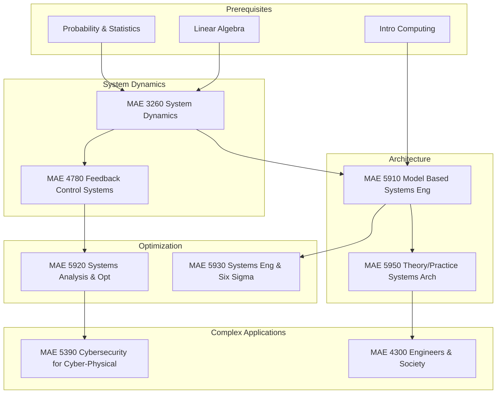

\
\
[Home]({{ '/' | relative_url }}) → [Mechanical Engineering]({{ '/maemajor/' | relative_url }}) → Systems Engineering
# MAE Major - Systems Engineering 🌐
Field of study on managing complexity in large-scale engineering projects. Covers system architecture, model-based systems engineering (MBSE), reliability, optimization, and decision-making frameworks.

## Flow Map

## Prerequisite Courses:
- **Probability & Statistics** — Modeling uncertainty, reliability, and stochastic processes (essential for Six Sigma).
- **Linear Algebra** — Matrix operations for state-space modeling and optimization algorithms.
- **Intro to Computing** — Programming logic required for simulations and MBSE tools.

## Core Courses:

- **MAE 3260 - System Dynamics**
  

  
Details

  

    

    <ul>
    <li>What you'll learn: Modeling complex multi-domain systems (mechanical, electrical, thermal) and understanding their time-domain behavior.</li>
    <li>Essential? Yes—the mathematical language of systems behavior.</li>
    <li>Recommended workflow: Junior year.</li>
    <li>Prereqs and why: Diff Eq, Linear Algebra.</li>
    </ul>
    

  

  

- **MAE 4780 - Feedback Control Systems**
  

  
Details

  

    

    <ul>
    <li>What you'll learn: Designing controllers to force systems to behave in desired ways despite disturbances. Stability analysis.</li>
    <li>Essential? Fundamental for active system management.</li>
    <li>Recommended workflow: Senior year.</li>
    <li>Prereqs and why: System Dynamics.</li>
    </ul>
    

  

  

- **MAE 5910 - Model Based Systems Engineering (MBSE)**
  

  
Details

  

    

    <ul>
    <li>What you'll learn: Using SysML (Systems Modeling Language) to define requirements, structure, behavior, and parametric constraints formally.</li>
    <li>Essential? Yes—this is the modern industry standard for managing complex projects.</li>
    <li>Recommended workflow: Senior/M.Eng.</li>
    <li>Prereqs and why: Computing/Engineering Core.</li>
    </ul>
    

  

  

- **MAE 5950 - Theory & Practice of Systems Architecture**
  

  
Details

  

    

    <ul>
    <li>What you'll learn: System decomposition, form-to-function mapping, heuristic design principles, and managing interfaces.</li>
    <li>Essential? Critical for high-level "Architect" roles.</li>
    <li>Recommended workflow: Senior/M.Eng.</li>
    <li>Prereqs and why: MBSE (helpful context).</li>
    </ul>
    

  

  

- **MAE 5920 - Systems Analysis & Optimization**
  

  
Details

  

    

    <ul>
    <li>What you'll learn: Linear/Nonlinear programming, utility theory, and decision-making under uncertainty.</li>
    <li>Essential? Yes—provides the math to prove one design is "better" than another.</li>
    <li>Recommended workflow: Senior/M.Eng.</li>
    <li>Prereqs and why: Linear Algebra.</li>
    </ul>
    

  

  

- **MAE 5930 - Systems Engineering & Six Sigma**
  

  
Details

  

    

    <ul>
    <li>What you'll learn: DMAIC (Define, Measure, Analyze, Improve, Control) process, statistical quality control, and lean manufacturing.</li>
    <li>Essential? Highly valued in manufacturing and operations roles.</li>
    <li>Recommended workflow: Senior/M.Eng.</li>
    <li>Prereqs and why: Statistics.</li>
    </ul>
    

  

  

- **MAE 5390 - Cybersecurity for Cyber-Physical Systems**
  

  
Details

  

    

    <ul>
    <li>What you'll learn: Vulnerability analysis, attack surfaces in SCADA/industrial control systems, and defensive design.</li>
    <li>Essential? Growing importance for connected infrastructure and defense.</li>
    <li>Recommended workflow: M.Eng / Grad.</li>
    <li>Prereqs and why: System Dynamics or Control.</li>
    </ul>
    

  

  

- **MAE 4300 - Professional Practice (Engineers & Society)**
  

  
Details

  

    

    <ul>
    <li>What you'll learn: Engineering ethics, social impact analysis, and professional responsibility in large technical systems.</li>
    <li>Essential? Yes—systems engineers must understand the human context of their designs.</li>
    <li>Recommended workflow: Senior year.</li>
    <li>Prereqs and why: Senior standing.</li>
    </ul>
    

  

  
