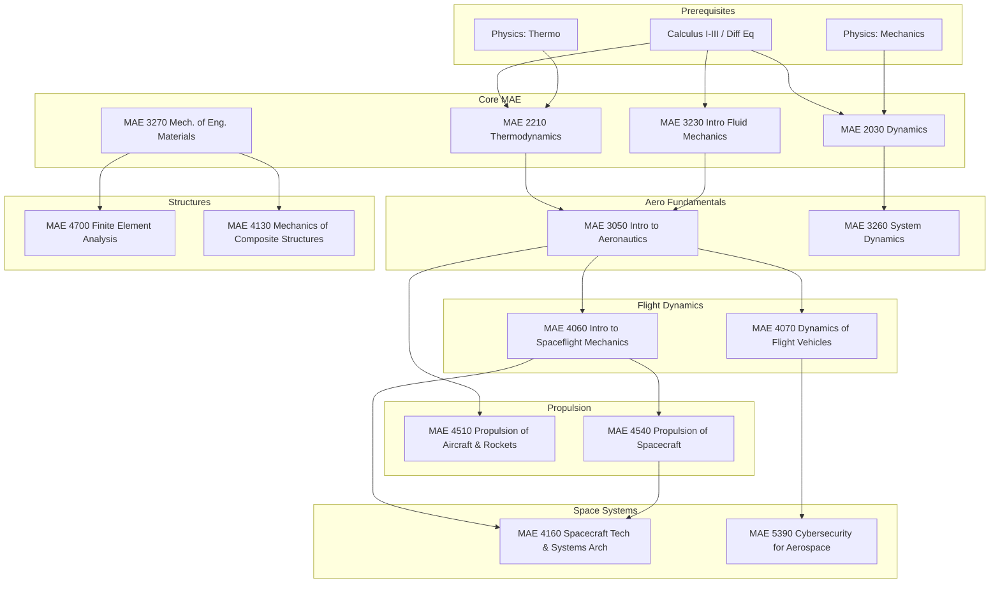

\
\
[Home]({{ '/' | relative_url }}) → [Mechanical Engineering]({{ '/maemajor/' | relative_url }}) → Aerospace Engineering
# MAE Major - Aerospace Engineering 🚀
Field of study focused on the design, analysis, and mechanics of airborne and spaceborne vehicles. Covers aerodynamics, propulsion, orbital mechanics, and flight dynamics.

## Flow Map

## Prerequisite Courses:
- **Multivariable Calculus & Differential Equations** — fluid flow, orbital trajectories, heat equations
- **Physics (Newtonian Mechanics)** — force balances, conservation of momentum/energy
- **Thermodynamics** — cycles, efficiency, gas laws (crucial for propulsion)
- **Fluid Mechanics** — Navier-Stokes, boundary layers, compressible flow
- **Dynamics** — rigid body motion, reference frames, vibrations
- **Statics/Mechanics of Materials** — stress/strain, material failure modes

## Core Courses:

- **MAE 3050 - Introduction to Aeronautics**
  

  
Details

  

    

    <ul>
    <li>What you'll learn: Standard atmosphere, airfoils, finite wings, drag polar, and aircraft performance/stability.</li>
    <li>Essential? Yes—the gateway course for the entire concentration.</li>
    <li>Recommended workflow: Take immediately after MAE 3230 (Fluids).</li>
    <li>Prereqs and why: Fluid Mechanics (Bernoulli's principle, viscosity).</li>
    </ul>
    

  

  

- **MAE 4060 - Introduction to Spaceflight Mechanics**
  

  
Details

  

    

    <ul>
    <li>What you'll learn: Two-body problem, orbital maneuvers (Hohmann transfer), interplanetary trajectories, and restricted three-body problem.</li>
    <li>Essential? Yes—fundamental for any space-related role.</li>
    <li>Recommended workflow: Junior/Senior year; pairs well with Propulsion.</li>
    <li>Prereqs and why: Dynamics (Newton's laws, angular momentum conservation).</li>
    </ul>
    

  

  

- **MAE 4070 - Dynamics of Flight Vehicles**
  

  
Details

  

    

    <ul>
    <li>What you'll learn: Equations of motion for rigid aircraft, stability derivatives, longitudinal/lateral modes, and autopilot control.</li>
    <li>Essential? Core for atmospheric flight paths (GNC engineers).</li>
    <li>Recommended workflow: After System Dynamics (MAE 3260).</li>
    <li>Prereqs and why: System Dynamics (transfer functions, eigenvalues for stability).</li>
    </ul>
    

  

  

- **MAE 4130 - Mechanics of Composite Structures**
  

  
Details

  

    

    <ul>
    <li>What you'll learn: Anisotropic elasticity, laminate theory, failure criteria for carbon fiber/epoxy structures.</li>
    <li>Essential? Highly recommended for structural roles (Boeing/SpaceX).</li>
    <li>Recommended workflow: Senior elective.</li>
    <li>Prereqs and why: Mechanics of Materials (stress tensors).</li>
    </ul>
    

  

  

- **MAE 4160 - Spacecraft Technology and Systems Architecture**
  

  
Details

  

    

    <ul>
    <li>What you'll learn: Space mission design, subsystems (power, thermal, comms, ADCS), and link budgets.</li>
    <li>Essential? The "Capstone" of the space track.</li>
    <li>Recommended workflow: Senior year; synthesize knowledge from all previous courses.</li>
    <li>Prereqs and why: Spaceflight Mechanics (orbits dictate power/thermal environments).</li>
    </ul>
    

  

  

- **MAE 4510 - Propulsion of Aircraft and Rockets**
  

  
Details

  

    

    <ul>
    <li>What you'll learn: Turbojets, turbofans, ramjets, nozzle flow, and chemical rocket basics.</li>
    <li>Essential? Yes for propulsion engineers.</li>
    <li>Recommended workflow: After Thermodynamics and Compressible Flow.</li>
    <li>Prereqs and why: Thermodynamics (Brayton cycles), Fluids (shock waves).</li>
    </ul>
    

  

  

- **MAE 4540 - Propulsion of Spacecraft**
  

  
Details

  

    

    <ul>
    <li>What you'll learn: Electric propulsion (Hall thrusters, ion engines), nuclear thermal, and advanced chemical propulsion.</li>
    <li>Essential? Elective for deep space/satellite propulsion specialization.</li>
    <li>Recommended workflow: After MAE 4060 or 4510.</li>
    <li>Prereqs and why: Physics E&M (for electric propulsion fields), Thermodynamics.</li>
    </ul>
    

  

  

- **MAE 4700 - Finite Element Analysis**
  

  
Details

  

    

    <ul>
    <li>What you'll learn: Numerical solutions to stress/strain problems, meshing, and commercial FEA software usage (ANSYS/Abaqus).</li>
    <li>Essential? Industry standard skill for structural validation.</li>
    <li>Recommended workflow: Senior year or concurrent with design teams.</li>
    <li>Prereqs and why: Linear Algebra (matrix solvers), Mechanics of Materials.</li>
    </ul>
    

  

  

- **MAE 5390 - Cybersecurity for Cyber-Physical and Aerospace Systems**
  

  
Details

  

    

    <ul>
    <li>What you'll learn: Attack surfaces in avionics, spoofing, jamming, and securing flight software.</li>
    <li>Essential? Niche but rapidly growing importance.</li>
    <li>Recommended workflow: Advanced elective for systems-focused students.</li>
    <li>Prereqs and why: Basic coding and systems understanding.</li>
    </ul>
    

  

  
