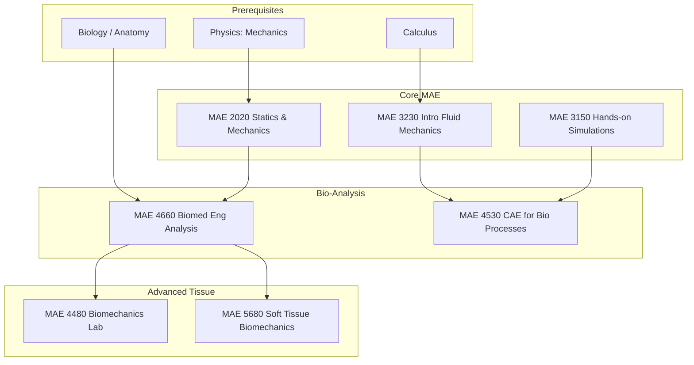

\
\
[Home]({{ '/' | relative_url }}) → [Mechanical Engineering]({{ '/maemajor/' | relative_url }}) → Biomechanics
# MAE Major - Biomechanics 🦴
Application of mechanical engineering principles to biological systems. Focuses on soft tissue mechanics, structural analysis of metabolic systems, and computer-aided engineering for medical devices and biological processes.

## Flow Map

## Prerequisite Courses:
- **Physics (Mechanics)** — Forces, moments, and equilibrium (crucial for musculoskeletal analysis).
- **Calculus** — Mathematical foundation for fluid rates and structural deformation.
- **Biology / Anatomy** — *Highly recommended* to understand the physiology and terminology behind the mechanics.

## Core Courses:

- **MAE 2020 - Statics & Mechanics**
  

  
Details

  

    

    <ul>
    <li>What you'll learn: Free body diagrams, stress/strain, and structural failure criteria.</li>
    <li>Essential? Yes—bones and implants are mechanical structures that must not fail.</li>
    <li>Recommended workflow: Sophomore Fall.</li>
    <li>Prereqs and why: Physics.</li>
    </ul>
    

  

  

- **MAE 3230 - Intro Fluid Mechanics**
  

  
Details

  

    

    <ul>
    <li>What you'll learn: Pressure gradients, viscosity, and flow through pipes (analogous to blood vessels).</li>
    <li>Essential? Yes—required for cardiovascular and microfluidic applications.</li>
    <li>Recommended workflow: Junior Fall.</li>
    <li>Prereqs and why: Calculus.</li>
    </ul>
    

  

  

- **MAE 3150 - Hands-on Simulations**
  

  
Details

  

    

    <ul>
    <li>What you'll learn: Introduction to computational tools, validating models against data, and basic simulation workflows.</li>
    <li>Essential? Yes—provides the digital toolkit needed for advanced Bio-CAE.</li>
    <li>Recommended workflow: Junior year.</li>
    <li>Prereqs and why: Physics.</li>
    </ul>
    

  

  

- **MAE 4660 - Biomed Eng Analysis**
  

  
Details

  

    

    <ul>
    <li>What you'll learn: Quantitative analysis of physiological systems, scaling laws, and structural mechanics applied to anatomy.</li>
    <li>Essential? The foundational bridge course between MAE and BME.</li>
    <li>Recommended workflow: Senior Fall.</li>
    <li>Prereqs and why: Statics (MAE 2020), Biology.</li>
    </ul>
    

  

  

- **MAE 4530 - CAE for Bio Processes**
  

  
Details

  

    

    <ul>
    <li>What you'll learn: Using simulation tools (like COMSOL or ANSYS) to model drug delivery, blood flow, and tissue heating.</li>
    <li>Essential? Critical for modern medical device design.</li>
    <li>Recommended workflow: Senior Spring.</li>
    <li>Prereqs and why: Fluids, Hands-on Simulations (MAE 3150).</li>
    </ul>
    

  

  

- **MAE 4480 - Biomechanics Lab**
  

  
Details

  

    

    <ul>
    <li>What you'll learn: Experimental testing of biological tissues, biomaterials, and prosthetics. Data acquisition and statistical analysis.</li>
    <li>Essential? Yes—hands-on experience with the variability of biological materials.</li>
    <li>Recommended workflow: Senior Spring.</li>
    <li>Prereqs and why: Biomedical Analysis (MAE 4660).</li>
    </ul>
    

  

  

- **MAE 5680 - Soft Tissue Biomechanics**
  

  
Details

  

    

    <ul>
    <li>What you'll learn: Large deformation theory, nonlinear elasticity, and viscoelasticity of skin, heart valves, and ligaments.</li>
    <li>Essential? For advanced research or high-end medical device engineering.</li>
    <li>Recommended workflow: M.Eng / Grad.</li>
    <li>Prereqs and why: Biomedical Analysis (MAE 4660).</li>
    </ul>
    

  

  
