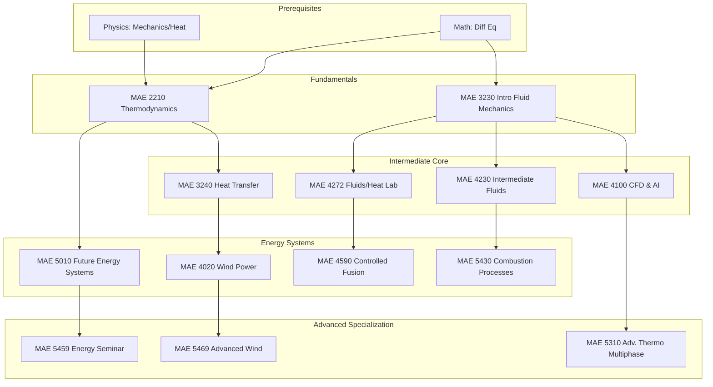

\
\
[Home]({{ '/' | relative_url }}) → [Mechanical Engineering]({{ '/maemajor/' | relative_url }}) → Energy & Thermal-Fluids
# MAE Major - Energy & Thermal-Fluids ⚡
Field of study on the generation, conversion, and transfer of energy. Covers thermodynamics, fluid dynamics, heat transfer, and advanced applications in renewable energy (wind, fusion), combustion, and multiphase systems.

## Flow Map

## Prerequisite Courses:
- **Differential Equations** — Modeling rates of change, heat diffusion, and fluid flow behaviors.
- **Physics (Mechanics & Heat)** — Conservation of energy, work, and basic thermal properties.
- **Multivariable Calculus** — Vector fields, gradients, and flux (critical for Fluid Dynamics).

## Core Courses:

- **MAE 2210 - Thermodynamics**
  

  
Details

  

    

    <ul>
    <li>What you'll learn: The Laws of Thermodynamics, entropy, phase changes, and power cycles (Rankine, Brayton, Otto).</li>
    <li>Essential? Yes—this is the bedrock of all energy systems.</li>
    <li>Recommended workflow: Sophomore year.</li>
    <li>Prereqs and why: Physics and Diff Eq (math foundation).</li>
    </ul>
    

  

  

- **MAE 3230 - Intro to Fluid Mechanics**
  

  
Details

  

    

    <ul>
    <li>What you'll learn: Hydrostatics, Bernoulli’s equation, control volume analysis, and an introduction to Navier-Stokes.</li>
    <li>Essential? Yes—required for aerodynamics, hydro power, and pipe flow.</li>
    <li>Recommended workflow: Junior Fall.</li>
    <li>Prereqs and why: Multivariable Calculus (vector fields), Dynamics.</li>
    </ul>
    

  

  

- **MAE 3240 - Heat Transfer**
  

  
Details

  

    

    <ul>
    <li>What you'll learn: Conduction, convection, and radiation. Designing heat exchangers and cooling systems.</li>
    <li>Essential? Yes—critical for thermal management and efficiency.</li>
    <li>Recommended workflow: Junior Spring.</li>
    <li>Prereqs and why: Thermodynamics (energy balance), Fluids (convection).</li>
    </ul>
    

  

  

- **MAE 5010 - Future Energy Systems**
  

  
Details

  

    

    <ul>
    <li>What you'll learn: Analysis of renewable technologies, grid integration, storage economics, and carbon footprint.</li>
    <li>Essential? Great overview for students wanting a career in renewables.</li>
    <li>Recommended workflow: Senior/M.Eng year.</li>
    <li>Prereqs and why: Thermodynamics.</li>
    </ul>
    

  

  

- **MAE 4230 - Intermediate Fluid Mechanics**
  

  
Details

  

    

    <ul>
    <li>What you'll learn: Compressible flow (supersonics), boundary layer theory, and potential flow.</li>
    <li>Essential? Key for aerospace and high-speed propulsion.</li>
    <li>Recommended workflow: Senior year.</li>
    <li>Prereqs and why: Intro Fluids.</li>
    </ul>
    

  

  

- **MAE 4272 - Fluids & Heat Transfer Lab**
  

  
Details

  

    

    <ul>
    <li>What you'll learn: Experimental techniques, wind tunnel testing, and data analysis for thermal-fluid systems.</li>
    <li>Essential? Yes—provides practical hands-on diagnostics experience.</li>
    <li>Recommended workflow: Senior year.</li>
    <li>Prereqs and why: Intro Fluids.</li>
    </ul>
    

  

  

- **MAE 4100 - CFD & AI (Computer-Aided Engineering)**
  

  
Details

  

    

    <ul>
    <li>What you'll learn: Computational Fluid Dynamics (CFD), numerical methods, and applying Machine Learning to flow simulation.</li>
    <li>Essential? Highly recommended for simulation roles.</li>
    <li>Recommended workflow: Senior year.</li>
    <li>Prereqs and why: Intro Fluids.</li>
    </ul>
    

  

  

- **MAE 4020 - Wind Power**
  

  
Details

  

    

    <ul>
    <li>What you'll learn: Blade aerodynamics (BEM theory), wind resource assessment, and turbine mechanics.</li>
    <li>Essential? The primary course for wind energy careers.</li>
    <li>Recommended workflow: Senior/M.Eng.</li>
    <li>Prereqs and why: Fluids, Heat Transfer (for atmospheric boundary layers).</li>
    </ul>
    

  

  

- **MAE 5430 - Combustion Processes**
  

  
Details

  

    

    <ul>
    <li>What you'll learn: Chemical kinetics, flame propagation, emissions formation, and engine efficiency.</li>
    <li>Essential? Critical for propulsion and automotive sectors.</li>
    <li>Recommended workflow: Senior/M.Eng.</li>
    <li>Prereqs and why: Intermediate Fluids, Thermodynamics.</li>
    </ul>
    

  

  

- **MAE 4590 - Introduction to Controlled Fusion**
  

  
Details

  

    

    <ul>
    <li>What you'll learn: Plasma physics, magnetic confinement (Tokamaks), and inertial confinement fusion.</li>
    <li>Essential? Niche but critical for next-gen nuclear energy.</li>
    <li>Recommended workflow: Senior/M.Eng.</li>
    <li>Prereqs and why: Fluids/Heat Lab (experimental basis), Physics E&M.</li>
    </ul>
    

  

  

- **MAE 5310 - Advanced Thermodynamics & Multiphase Flow**
  

  
Details

  

    

    <ul>
    <li>What you'll learn: Statistical thermodynamics, liquid-vapor phase change, and mixture theory.</li>
    <li>Essential? Advanced theory for research and complex material systems.</li>
    <li>Recommended workflow: M.Eng / Grad.</li>
    <li>Prereqs and why: CFD or Intermediate Fluids.</li>
    </ul>
    

  

  
