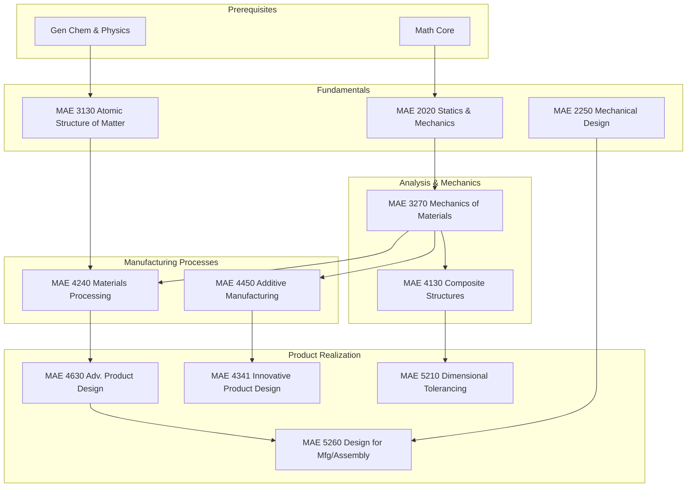

\
\
[Home]({{ '/' | relative_url }}) → [Mechanical Engineering]({{ '/maemajor/' | relative_url }}) → Materials & Manufacturing
# MAE Major - Materials & Manufacturing 🔬
Field of study connecting the atomic structure of matter to macroscopic mechanical properties and production. Covers composite materials, additive manufacturing (3D printing), digital manufacturing, and product design.

## Flow Map

## Prerequisite Courses:
- **General Chemistry** — Atomic bonding, periodic trends, and chemical reactions (basis for material properties).
- **Physics (Mechanics)** — Forces, equilibrium, and energy.
- **Math Core** — Calculus and Differential Equations for stress analysis.

## Core Courses:

- **MAE 2020 - Statics and Mechanics of Solids**
  

  
Details

  

    

    <ul>
    <li>What you'll learn: Free body diagrams, stress/strain relationships, beam bending, torsion, and failure criteria (Von Mises).</li>
    <li>Essential? Yes—the absolute foundation of mechanical engineering.</li>
    <li>Recommended workflow: Sophomore Fall.</li>
    <li>Prereqs and why: Math/Physics.</li>
    </ul>
    

  

  

- **MAE 2250 - Mechanical Synthesis (Machine Design)**
  

  
Details

  

    

    <ul>
    <li>What you'll learn: Design of mechanisms, fatigue analysis, bearings, gears, and component reliability.</li>
    <li>Essential? Yes—connects theory to practical machinery.</li>
    <li>Recommended workflow: Sophomore Spring.</li>
    <li>Prereqs and why: Statics (MAE 2020).</li>
    </ul>
    

  

  

- **MAE 3130 - Atomic and Molecular Structure of Matter**
  

  
Details

  

    

    <ul>
    <li>What you'll learn: Crystal lattices, defects, phase diagrams, and how atomic structure dictates strength and conductivity.</li>
    <li>Essential? Yes—bridges the gap between Chemistry and Engineering.</li>
    <li>Recommended workflow: Junior Fall.</li>
    <li>Prereqs and why: Chemistry, Physics.</li>
    </ul>
    

  

  

- **MAE 3270 - Mechanics of Engineering Materials**
  

  
Details

  

    

    <ul>
    <li>What you'll learn: Plasticity, fracture mechanics, fatigue life prediction, and time-dependent deformation (creep).</li>
    <li>Essential? Yes—critical for preventing structural failure.</li>
    <li>Recommended workflow: Junior Spring.</li>
    <li>Prereqs and why: Statics & Mechanics (MAE 2020).</li>
    </ul>
    

  

  

- **MAE 4240 - Materials Processing for Mechanical Engineers**
  

  
Details

  

    

    <ul>
    <li>What you'll learn: How things are made—casting, forging, rolling, extrusion, and injection molding physics.</li>
    <li>Essential? Highly recommended for understanding how design impacts production.</li>
    <li>Recommended workflow: Senior Fall.</li>
    <li>Prereqs and why: Mechanics of Materials, Atomic Structure.</li>
    </ul>
    

  

  

- **MAE 4130 - Mechanics of Composite Structures**
  

  
Details

  

    

    <ul>
    <li>What you'll learn: Anisotropic materials, carbon fiber laminates, sandwich structures, and failure modes in composites.</li>
    <li>Essential? Critical for Aerospace and high-performance Auto sectors.</li>
    <li>Recommended workflow: Senior/M.Eng.</li>
    <li>Prereqs and why: Mechanics of Materials.</li>
    </ul>
    

  

  

- **MAE 4450 - Introduction to Additive Manufacturing (3D Printing)**
  

  
Details

  

    

    <ul>
    <li>What you'll learn: FDM, SLA, SLS, metal sintering, and the material science behind layer-by-layer adhesion.</li>
    <li>Essential? The modern standard for prototyping and complex geometry.</li>
    <li>Recommended workflow: Senior elective.</li>
    <li>Prereqs and why: Mechanics of Materials.</li>
    </ul>
    

  

  

- **MAE 4630 - Advanced Product Design**
  

  
Details

  

    

    <ul>
    <li>What you'll learn: The full design lifecycle—user needs, concept generation, prototyping, and design refinement.</li>
    <li>Essential? Capstone-level design experience.</li>
    <li>Recommended workflow: Senior/M.Eng.</li>
    <li>Prereqs and why: Materials Processing (understanding constraints).</li>
    </ul>
    

  

  

- **MAE 5260 - Design for Manufacture and Assembly (DFMA)**
  

  
Details

  

    

    <ul>
    <li>What you'll learn: Modifying designs to reduce part count, cost estimation, and optimizing for automated assembly.</li>
    <li>Essential? Vital for mass-production engineering roles.</li>
    <li>Recommended workflow: M.Eng / Senior Spring.</li>
    <li>Prereqs and why: Mechanical Design (MAE 2250).</li>
    </ul>
    

  

  

- **MAE 5210 - Dimensional Tolerancing and Metrology**
  

  
Details

  

    

    <ul>
    <li>What you'll learn: GD&T (Geometric Dimensioning and Tolerancing), measurement uncertainty, and quality control.</li>
    <li>Essential? Yes—drawings are the language of engineering, and this teaches you to speak it fluently.</li>
    <li>Recommended workflow: Senior/M.Eng.</li>
    <li>Prereqs and why: Composite Structures or Manufacturing background.</li>
    </ul>
    

  

  

- **MAE 4341 - Innovative Product Design via Digital Manufacturing**
  

  
Details

  

    

    <ul>
    <li>What you'll learn: Leveraging digital tools (CAD/CAM/CAE) to drive innovation and rapid iteration in product development.</li>
    <li>Essential? Great for entrepreneurial engineers.</li>
    <li>Recommended workflow: Senior Spring.</li>
    <li>Prereqs and why: Additive Manufacturing.</li>
    </ul>
    

  

  
