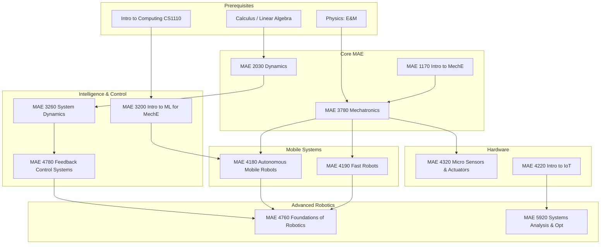

\
\
[Home]({{ '/' | relative_url }}) → [Mechanical Engineering]({{ '/maemajor/' | relative_url }}) → Robotics & Mechatronics
# MAE Major - Robotics & Mechatronics 🤖
Interdisciplinary field combining mechanical systems with electronics and software control. Focuses on autonomous mobile robots, feedback control systems, sensors/actuators, and machine learning applied to physical systems.

## Flow Map

## Prerequisite Courses:
- **Intro to Computing (Python)** — Programming logic, data structures, and algorithms (critical for all robotics).
- **Linear Algebra** — Coordinate transformations, state-space representations, matrix operations.
- **Physics (Electricity & Magnetism)** — Circuits, sensors, electromagnetic actuation.
- **Dynamics** — Rigid body motion, kinematics, kinetics (Newton/Euler).
- **Differential Equations** — Modeling physical systems (mass-spring-damper, RLC circuits).

## Core Courses:

- **MAE 3780 - Mechatronics**
  

  
Details

  

    

    <ul>
    <li>What you'll learn: Microcontrollers (Arduino/STM32), sensors, actuators, circuit design, and embedded C programming.</li>
    <li>Essential? Yes—this is the foundational hardware/software bridge course.</li>
    <li>Recommended workflow: Sophomore Spring or Junior Fall.</li>
    <li>Prereqs and why: Physics E&M (circuits), Intro CS (coding logic).</li>
    </ul>
    

  

  

- **MAE 3260 - System Dynamics**
  

  
Details

  

    

    <ul>
    <li>What you'll learn: Modeling mechanical/electrical systems, transfer functions, frequency response, and time-domain analysis.</li>
    <li>Essential? Yes—prerequisite for all control theory.</li>
    <li>Recommended workflow: Junior year.</li>
    <li>Prereqs and why: Dynamics and Diff Eq (math foundation).</li>
    </ul>
    

  

  

- **MAE 3200 - Introduction to Machine Learning for Mechanical Engineers**
  

  
Details

  

    

    <ul>
    <li>What you'll learn: Supervised/unsupervised learning, neural networks, and regression specifically applied to physical data.</li>
    <li>Essential? Highly recommended for modern autonomous systems.</li>
    <li>Recommended workflow: Junior year.</li>
    <li>Prereqs and why: Linear Algebra, Probability, Coding.</li>
    </ul>
    

  

  

- **MAE 4180 - Autonomous Mobile Robots**
  

  
Details

  

    

    <ul>
    <li>What you'll learn: Localization (Kalman Filters, Monte Carlo), Mapping (SLAM), Path Planning (A*), and Computer Vision.</li>
    <li>Essential? The flagship robotics course for autonomy.</li>
    <li>Recommended workflow: Senior Fall.</li>
    <li>Prereqs and why: Mechatronics (hardware), Probability (for filters).</li>
    </ul>
    

  

  

- **MAE 4190 - Fast Robots**
  

  
Details

  

    

    <ul>
    <li>What you'll learn: Building a high-speed autonomous car, aggressive maneuvering, state estimation at high frequency.</li>
    <li>Essential? Great for practical, hands-on integration skills.</li>
    <li>Recommended workflow: Senior Spring; often follows 4180.</li>
    <li>Prereqs and why: Mechatronics, Feedback Control.</li>
    </ul>
    

  

  

- **MAE 4780 - Feedback Control Systems**
  

  
Details

  

    

    <ul>
    <li>What you'll learn: PID control, root locus, Bode plots, stability margins, and compensator design.</li>
    <li>Essential? Yes—fundamental for making robots stable and precise.</li>
    <li>Recommended workflow: After System Dynamics.</li>
    <li>Prereqs and why: System Dynamics (Laplace transforms).</li>
    </ul>
    

  

  

- **MAE 4760 - Foundations of Robotics**
  

  
Details

  

    

    <ul>
    <li>What you'll learn: Kinematics (Forward/Inverse), Dynamics (Lagrangian), Jacobians, and trajectory generation for robot arms.</li>
    <li>Essential? Yes for manipulation and robotic arms.</li>
    <li>Recommended workflow: Senior year.</li>
    <li>Prereqs and why: Linear Algebra (rotation matrices), Dynamics.</li>
    </ul>
    

  

  

- **MAE 4320 - Integrated Micro Sensors and Actuators**
  

  
Details

  

    

    <ul>
    <li>What you'll learn: MEMS technology, micro-fabrication, capacitive sensing, and piezoelectric actuation.</li>
    <li>Essential? Elective for hardware-focused students.</li>
    <li>Recommended workflow: Senior/M.Eng elective.</li>
    <li>Prereqs and why: Physics, Mechatronics basics.</li>
    </ul>
    

  

  

- **MAE 4220 - Introduction to Internet of Things**
  

  
Details

  

    

    <ul>
    <li>What you'll learn: Connectivity (WiFi/BLE/LoRa), cloud data handling, edge computing, and distributed sensing.</li>
    <li>Essential? Good for connected systems/smart devices.</li>
    <li>Recommended workflow: Senior elective.</li>
    <li>Prereqs and why: Mechatronics or Embedded coding.</li>
    </ul>
    

  

  

