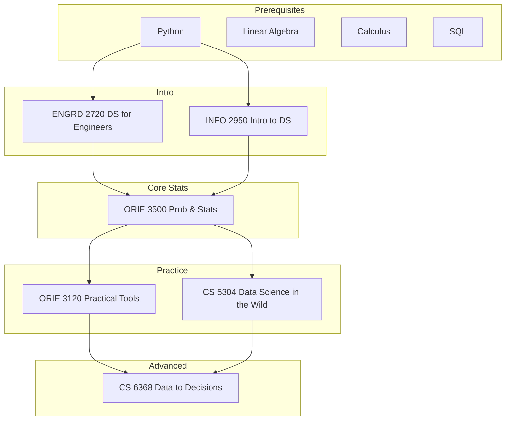

\
\
[Home]({{ '/' | relative_url }}) → [Operations Research & Engineering]({{ '/oriemajor/' | relative_url }}) → Data, Decisions, and AI

# ORIE Major - Data, Decisions, and AI         
Interdisciplinary field of study that uses algorithms and statistics to extract meaningful insights from large datasets.

## Flow Map

## Prerequisite Courses:
- Programming in Python — data wrangling, numerical computing, notebooks
- Linear Algebra (e.g., MATH 2210/2940) — model representations, SVD/PCA, optimization basics
- Calculus (single & multi-variable) — gradients, optimization, continuous models
- Probability & Statistics (e.g., ORIE 3500/ENGRD 2700) — inference, estimation, hypothesis testing
- Data Structures & Algorithms — efficient processing and scalability
- SQL & Data Management basics — querying, joins, indexing, normalization

## Core Courses:  
- **ENGRD 2720 - Data Science for Engineers**
  - What you'll learn: Python data stack, basic statistics, regression/classification, and end-to-end DS workflow.
  - Essential? Yes—intro foundation for engineers entering DS/ML.
  - Recommended workflow: Take early; build a small analysis project with proper documentation.
  - Prereqs and why: Intro programming; basic calculus helps.
- **ORIE 3500 - Engineering Probability and Statistics**
  - What you'll learn: Probability, random variables, estimation, hypothesis testing—core for inference.
  - Essential? Yes—statistics underpins DS rigor and experimentation.
  - Recommended workflow: Before applied DS/ML courses.
  - Prereqs and why: Calculus; comfort with algebraic manipulation.
- **INFO 2950 - Intro to Data Science**
  - What you'll learn: Data wrangling, EDA, visualization, modeling basics, and communication of results.
  - Essential? Recommended if you want a broader intro with viz/communication.
  - Recommended workflow: Early; pair with a project using real datasets.
  - Prereqs and why: Programming fundamentals; basic stats helpful.
- **CS 5304 - Data Science in the Wild**
  - What you'll learn: Practical DS at scale—messy data, pipelines, experiment design, and deployment.
  - Essential? Recommended for industry readiness.
  - Recommended workflow: After an intro DS/ML course; focus on reproducibility.
  - Prereqs and why: Python data stack; basic ML and SQL helpful.
- **CS 6368 - Data to Decisions: Principles of Efficient Data Science**
  - What you'll learn: Efficient algorithms and systems for DS; performance-aware data processing and learning.
  - Essential? Elective bridging algorithms/systems with DS.
  - Recommended workflow: After core DS and algorithms; profile and optimize pipelines.
  - Prereqs and why: Algorithms, data structures, and Python/SQL tooling.
- **ORIE 3120 - Practical Tools for Operations Research, Machine Learning and Data Science**
  - What you'll learn: Tooling for OR/ML/DS workflows: modeling, optimization packages, and experiment management.
  - Essential? Recommended to strengthen practical skillset.
  - Recommended workflow: After probability/stats; apply to a capstone project.
  - Prereqs and why: Probability/statistics; linear algebra for ML models.

ORIE 3320 Optimization for AI
 ORIE 3741 Learning with Big Messy Data
 ORIE 4570 Reinforcement Learning with Operations Research Applications
 ORIE 4740 Statistical Data Mining I
 ORIE 4750 Foundations of Causal Inference for Data-Driven Decisions (first offered in AY 2026-2027) 