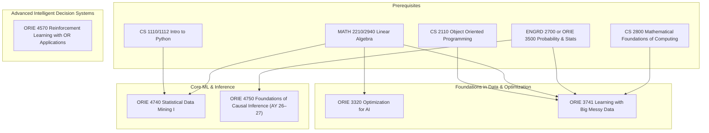

\
\
[Home]({{ '/' | relative_url }}) → [Operations Research & Engineering]({{ '/oriemajor/' | relative_url }}) → Data, Decisions, and AI

# ORIE Major - Data, Decisions, and AI         
Interdisciplinary field of study that uses algorithms and statistics to extract meaningful insights from large datasets.

## Flow Map

## Prerequisite Courses:
- Programming in Python — data wrangling, numerical computing, notebooks
- Linear Algebra (e.g., MATH 2210/2940) — model representations, SVD/PCA, optimization basics
- Calculus (single & multi-variable) — gradients, optimization, continuous models
- Probability & Statistics (e.g., ORIE 3500/ENGRD 2700) — inference, estimation, hypothesis testing
- Data Structures & Algorithms — efficient processing and scalability

## Core Courses:  
- **ORIE 3320 - Optimization for AI**
  

  
Details

    

    

    <ul>
    <li>What you'll learn: theory, algorithms, and applications of nonlinear optimization</li>
    <li>Essential? Yes, real-world applications of optimization in machine learning & OR</li>
    <li>Recommended workflow: Take as ORIE elective</li>
    <li>Prereqs and why: calculus and linear algebra; necessary for solving optimization problems</li>
    </ul>
    

    

  

- **ORIE 3741 - Learning with Big Messy Data**
  

  
Details

    

    

    <ul>
    <li>What you'll learn: scalable, robust methods for learning from large datasets</li>
    <li>Essential? Yes, sets up the rest of the data, decisions, and AI concentration</li>
    <li>Recommended workflow: after learning Python & linear algebra.</li>
    <li>Prereqs and why: linear algebra, probability, data structures, and discrete math; all necessary to understand optimal ways to clean & analyze data.</li>
    </ul>
    

    

  

- **ORIE 4740 - Statistical Data Mining I**
  

  
Details

    

    

    <ul>
    <li>What you'll learn: provides statistical foundation of data mining; including regression and Bayesian models.</li>
    <li>Essential? Yes, for rigor. Pairs well with ORIE 3741.</li>
    <li>Recommended workflow: after statistics & linear algebra, take before more specialized courses like RL.</li>
    <li>Prereqs and why: statistics and probability, programming experience (Python); assignments are mostly statistical computation.</li>
    </ul>
    

    

  

- **ORIE 4570 - Reinforcement Learning with Operations Research Applications**
  

  
Details

    

    

    <ul>
    <li>What you'll learn: practical reinforcement learning algorithms (TD, gradient-descent, etc.) for decision-making in real-world problems</li>
    <li>Essential? Probably not. Helpful if you're interested in research.</li>
    <li>Recommended workflow: after optimization and probability/stats. Counts for ORIE elective.</li>
    <li>Prereqs and why: ORIE 3300 (optimization) and ORIE 3500 (probability and statistics), need understanding of value-to-go functions and Markov Decision Processes. ORIE 3510 (Stochastic Processes) is also helpful, though not an explicit pre-requisite.</li>
    </ul>
    

    

  

- **ORIE 4750 - Foundations of Causal Inference for Data-Driven Decisions (first offered AY 2026-2027)**
  

  
Details

    

    

    <ul>
    <li>What you'll learn: how to move from correlation-based prediction to causal questions: counterfactuals, DAGs, etc.</li>
    <li>Essential? No, but recommended if you're interested in product decisions & policy</li>
    <li>Recommended workflow: After core stats and ML</li>
    <li>Prereqs and why: strong probability and statistics, comfort with regression and ML to understand assumptions and biases in causal models</li>
    </ul>
    

    

  
