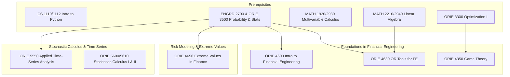

\
\
[Home]({{ '/' | relative_url }}) → [Operations Research & Engineering]({{ '/oriemajor/' | relative_url }}) → Financial Engineering

# ORIE Major - Financial Engineering
Field of study on quantitative analysis and management of financial instruments and risk.

## Flow Map

## Prerequisite Courses:
- Programming in Python — data analysis, simulation, backtesting
- Linear Algebra (e.g., MATH 2210/2940) — model representations, SVD/PCA, covariance matrices
- Calculus (single & multi-variable) — gradients, optimization, continuous models
- Probability & Statistics (e.g., ORIE 3500 & 3510, ENGRD 2700) — stochastic processes, risk measures

## Core Courses:  
- **ORIE 4350 - Introduction to Game Theory**
  

  
Details

    <ul>
    <li>- What you'll learn: broad survey of mathematical theory of games</li>
    <li>- Essential? No, but can help with understanding market microstructure & trading.</li>
    <li>- Recommended workflow: no strict time frame.</li>
    <li>- Prereqs and why: Optimization I, for basic linear programming (& algebra) knowledge.</li>
    </ul>
  

- **ORIE 4600 - Introduction to Financial Engineering**
  

  
Details

    <ul>
    <li>- What you'll learn: important ideas in modern finance like arbitrage, pricing, derivatives, risk measures. Focuses on discrete time models.</li>
    <li>- Essential? Yes, provides a foundation for financial engineering concepts.</li>
    <li>- Recommended workflow: Take early, prereq for other financial engineering courses.</li>
    <li>- Prereqs and why: probability & statistics. Stochastic processes. Necessary for understanding the randomness and probabilistic nature of finance.</li>
    </ul>
  

- **ORIE 4630 - OR Tools for Financial Engineering**
  

  
Details

    <ul>
    <li>- What you'll learn: applications of probability, stats, and optimization to finance. Time series, portfolio, pricing models.</li>
    <li>- Essential? Yes, covers important financial models & pricing techniques.</li>
    <li>- Recommended workflow: after ORIE 4600, though not an explicit pre requisite.</li>
    <li>- Prereqs and why: linear algebra, statistics and probability, and knowledge of R/multiple linear regression. R is widely used for computation & simulation in the course.</li>
    </ul>
  

- **ORIE 4656 - Extreme Values in Finance**
  

  
Details

    <ul>
    <li>- What you'll learn: tail risk modeling, extremely value theory, and systemtic risk</li>
    <li>- Essential? Recommended if you're interested in risk analytics.</li>
    <li>- Recommended workflow: following a probability/stats foundation.</li>
    <li>- Prereqs and why: probability (tail distributions), core topic in course.</li>
    </ul>
  

- **ORIE 5550 - Applied Time-Series Analysis**
  

  
Details

    <ul>
    <li>- What you'll learn: statistical tools for analysis of time-dependent data.</li>
    <li>- Essential? Yes, very useful in financial engineering jobs.</li>
    <li>- Recommended workflow: After an intro statistics / probability course. Graduate students get first priority.</li>
    <li>- Prereqs and why: stats and probability.</li>
    </ul>
  

- **ORIE 5600 / 5610 - Financial Engineering with Stochastic Calculus I & II**
  

  
Details

    <ul>
    <li>- What you'll learn: continuous-time models and mathematical tools required to use them.</li>
    <li>- Essential? No, but covers a lot of important topics like Black-Scholes, Brownian Motion. Priority given to grad students.</li>
    <li>- Recommended workflow: After stochastic processes, with a strong probability foundation.</li>
    <li>- Prereqs and why: ORIE 3510, understanding of random proceeses.</li>
    </ul>
  

