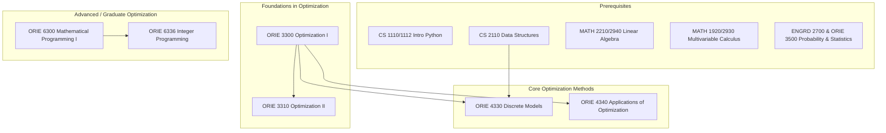

\
\
[Home]({{ '/' | relative_url }}) → [Operations Research & Engineering]({{ '/oriemajor/' | relative_url }}) → Optimization

# ORIE Major - Optimization
Field of study that concerns solving mathematical programs for decision making.

## Flow Map

## Prerequisite Courses:
- Programming & Data Structures -- implementing solvers, OR-Tools like Gurobi
- Algorithm Design -- discrete optimization, graph theory, complexity of algorithms
- Linear Algebra (e.g., MATH 2210/2940) — LP matrix form, duality, convexity
- Calculus (single & multi-variable) — gradients, optimality conditions
- Probability & Statistics (e.g., ORIE 3500/ENGRD 2700) — stochastic optimization and simulation methods.

## Core Courses:  
- **ORIE 3300 / 3310 - Optimization I**
  - What you'll learn: foundation of linear programming and solutions by the simplex method.
  - Essential? Yes, intro to optimization.
  - Recommended workflow: Take early, pre-req for many ORIE & optimization courses.
  - Prereqs and why: Linear algebra, which is the mathematical foundation of linear programming.
  - **ORIE 3310 - Optimization II**
  - What you'll learn: formulation of integer programming, dynamic programming, and network optimization models.
  - Essential? Yes, into to nonlinear optimization methods.
  - Recommended workflow: Take following ORIE 3300. Useful for designing algorithms and discrete models.
  - Prereqs and why: Optimization I, helps to have the linear programming background, as the class does reference LPs.
- **ORIE 4330 - Discrete Models**
  - What you'll learn: graphs, networks, and discrete optimization. Fundamental models and algorithmic techniques for analysis.
  - Essential? No, especially if you've taken algorithms (4820). 
  - Recommended workflow: After Optimization I, but seems there are many overlaps with Optimization II.
  - Prereqs and why: Optimization I and Data Structures. Need understanding of basic algorithms like BFS, DFS to analyze and design discrete models.
- **ORIE 4340 - Applications of Optimization: Modeling & Computation**
  - What you'll learn: applications of optimization models in manufacturing, retail, distribution, etc.
  - Essential? No, but provides real-world applications of Optimization I (3300) concepts.
  - Recommended workflow: any time after ORIE 3300
  - Prereqs and why: optimization I; need LP fundamental knowledge.
- **ORIE 6300 - Mathematical Programming I**
  - What you'll learn: rigorous treatment of theory & computational techniques of linear programming and its extensions.
  - Essential? Recommended for students interested in graduate studies in Operations Research. 
  - Recommended workflow: after intro optimization courses; proof-based math courses would be helpful too. 
  - Prereqs and why: no formal prereqs, but should have familiarity with linear algebra, basic analysis, and proofs.
- **ORIE 6336 - Integer Programming**
  - What you'll learn: optimization methods over mixed-integer sets and mathematical foundations of such problems.
  - Essential? Recommended for those interested in graduate studies in OR/optimization.
  - Recommended workflow: after 6300
  - Prereqs and why: Mathematical Programming I (6300). Need LP foundations.