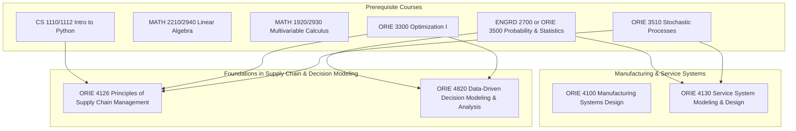

\
\
[Home]({{ '/' | relative_url }}) → [Operations Research & Engineering]({{ '/oriemajor/' | relative_url }}) → Supply Chain & Operations

# ORIE Major - Supply Chain & Operations
Field of study on the design & execution of supply chains in various industries.

## Flow Map

## Prerequisite Courses:
- Programming in Python — data wrangling, implementation of supply chain and operations models
- Linear Algebra (e.g., MATH 2210/2940) — model representations, SVD/PCA, optimization basics
- Calculus (single & multi-variable) — gradients, optimization, continuous models
- Probability & Statistics (e.g., ORIE 3500/ENGRD 2700) — demand uncertainty, performance metrics, and data-driven analysis.
- Optimization -- linear programming and basic optimization, useful for inventory models, network flows, and decision models
- Stochastic Processes -- queueing, arrival processes, and Markov models

## Core Courses:  
- **ORIE 4100 - Manufacturing Systems Design: A Consulting Boot Camp**
  - What you'll learn: design and analysis of manufacturing logistics systems, collaboration in real-world industry projects
  - Essential? Recommended for students interested in consulting and project management.
  - Recommended workflow: Take after some intro probability/stats courses. Taking as an underclassmen could help with job search.
  - Prereqs and why: None explicitly. 
- **ORIE 4126 - Principles of Supply Chain Management**
  - What you'll learn: key principles of effective supply chains through a collection of cases. 
  - Essential? Yes -- introduces basic analysis & design of global supply chains, along with analytical techniques.
  - Recommended workflow: take as elective junior or senior year.
  - Prereqs and why: mathematical programming and stochastic processes, as well as familiarity with Python to complete assignments.
- **ORIE 4130 - Service System Modeling & Design**
  - What you'll learn: techniques for analysis and design of service systems like contact centers, airlines, insurance, and healthcare.
  - Essential? Recommended for real-world applications of stochastic processes.
  - Recommended workflow: ORIE elective, take after prerequisities.
  - Prereqs and why: Probability and statistics helpful for understanding random nature of service systems, as well as stochastic processes.
- **ORIE 4820 - Data-Driven Decision Modeling and Analysis**
  - What you'll learn: classical modeling techniques with modern computational tools, particularly Excel, Python, and Power BI.
  - Essential? Yes -- helpful for consulting and data analytics roles.
  - Recommended workflow: before or during junior year; helpful for interview and career prep.
  - Prereqs and why: basic probability and statistics, as well as linear programming; will be solved using computational tools.